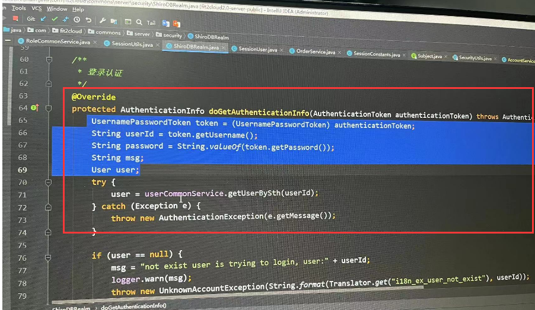
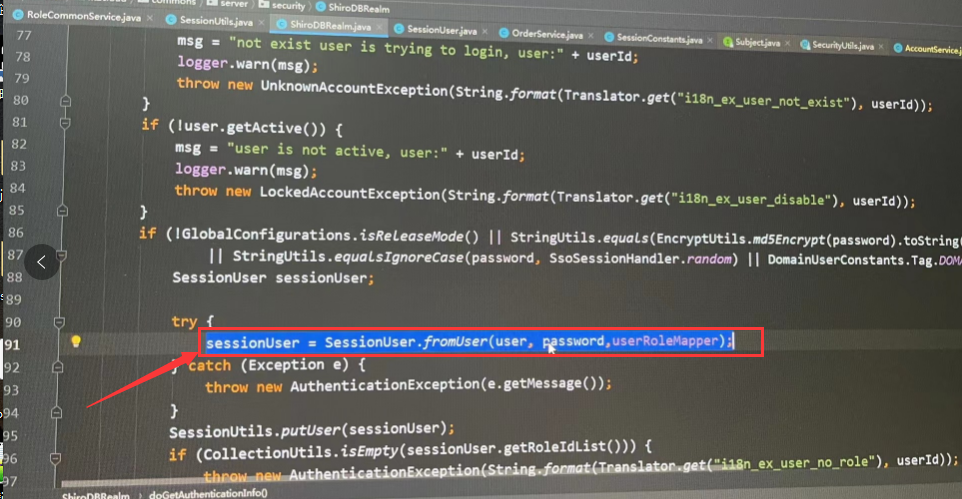

# 18、后台通过session获取用户信息

​		      例如使用的是Shiro作为权限管理 

#### 	1、session后端设置的位置		

​		在我们前端发起登录请求后认证通过时，我们会在后台设置一个session

​	

​			图中没有设置session在下面有设置session

#### 2、获取session用户

​			我们在后台可以通过 获取Subject 来获取session----这个session是后台的并不是前台的

​			Subject s = SecurityUtils.getSubject();

​			Session session = subject.getSession();

   

​    从而获取session的详细内容

​		如：

​			session.getAttribute("session_user")

