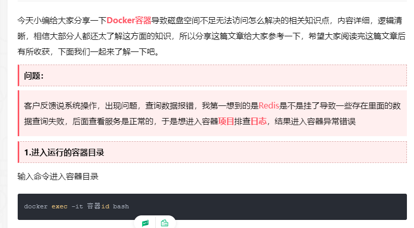

# 22、docker无法进入容器


​		客户反馈说系统操作，出现问题，查询数据报错，我第一想到的是[Redis](https://www.yisu.com/redis/)是不是挂了导致一些存在里面的数据查询失败，后面查看服务是正常的，于是想进入容器[**项目**](https://www.lsjlt.com/tag/项目/)排查[**日志**](https://www.lsjlt.com/tag/日志/)，结果进入容器异常错误


https://www.lsjlt.com/news/329468.html


​	输入命令进入容器

```bash
docker exec -it 容器id bash
```





提示错误信息:

> f[**ai**](https://www.lsjlt.com/tag/ai/)led to create runc console [**Socket**](https://www.lsjlt.com/tag/Socket/): mkdir /tmp/pty984695674: no space left on device: unknown ( [**翻译**](https://www.lsjlt.com/tag/翻译/)下就是:设备上没有剩余空间:未知 )

查看磁盘详情

```bash
df -h 
	# 磁盘空间已经被使用了100%可以看出Docker目录占用了大量的空间，我们应该对Docker运行的日志进行删除释放一些存储空间，这样才能进入运行的容器目录查看错误信息。
```


磁盘空间已经被使用了100%可以看出Docker目录占用了大量的空间，我们应该对Docker运行的日志进行删除释放一些存储空间，这样才能进入运行的容器目录查看错误信息。

### 2.查看容器的配置信息

需要知道容器在宿主机上的位置,由于我们已经没办法进入容器里面删除数据了查看容器在宿主机上的配置信息

```bash
docker inspect 容器id
```


查看宿主机的日志路径通过 cd 日志路径进入到命令下,通过命令 ls -lh 查看文件大小

**Docker容器导致磁盘空间不足无法访问怎么解决**

可以看出文件的占用了23G删除前我们需要停止容器

```swift
//停止容器docker stop 容器id
```


### 3.删除日志文件

在通过命令删除日志文件

```bash
rm -rf 删除文件名称
```

删除完成日志后查看磁盘空间

可以看出已经有空间了,这个时候我们就可以进入容器进行操作


### 4.正常进入容器

```bash
docker exec -it 容器id bash
```


已经可以进入容器了,进行排查工作了.


