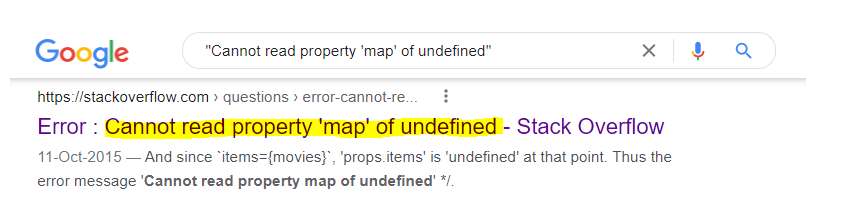
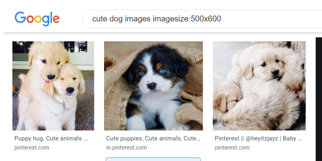
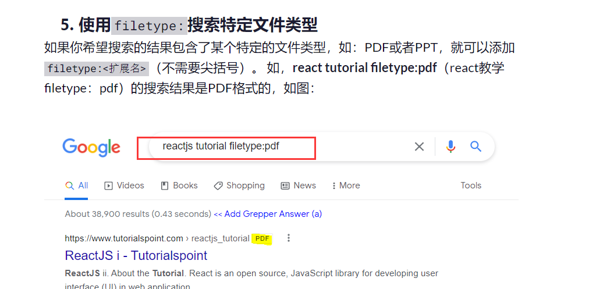
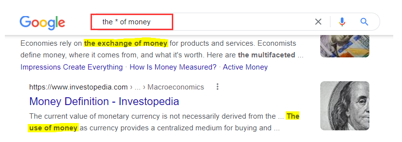

# 23、google搜索技巧

#### 1、完全匹配 

​		将我们搜索的关键词完全匹配

但如果你将自己的查询请求或者问题（词汇或者短语）用引号打包，像这样 —— `"你的问题"`，Google就会进入深度搜索模式。这样的搜索结果会**包含所有**在引号内你的搜索问题里的词汇。

#### 	2、搜索特定大小的图片

### 		使用`imagesize:`搜索特定大小的图片

如果你想搜索特定大小的图片，可以在你的搜索查询中使用`imagesize:`标签，并且标注好以**pixels（像素）** 为单位的宽和高。

#### 	3、搜索特定类型的文件filetype

#### 	4、搜索使用通配符 *

​	例如，如果你搜索 => the * of money（钱的 *），会产生如下结果。 Google会返回一系列搜索页面，包括 "the *exchange* of money"（金钱交易）、 "the *use* of money"（金钱的用途）、 "the *role* of money"（金钱的角色）、 "the *psychology* of money"（金钱心理学）等。

​	

https://www.freecodecamp.org/chinese/news/how-to-google-like-a-pro-10-tips-for-effective-googling/

