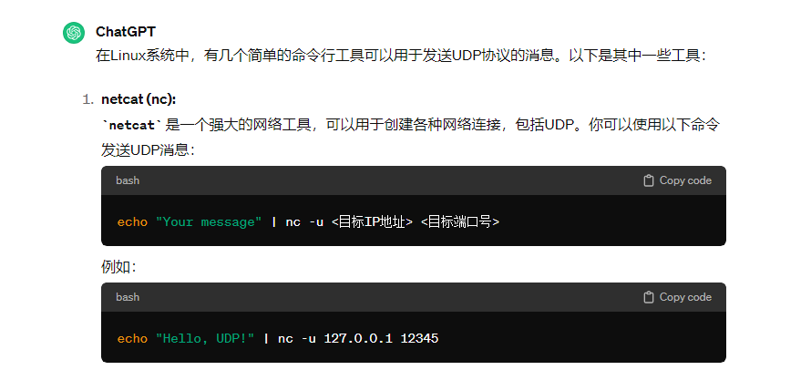
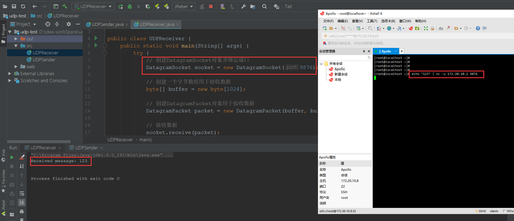

# 25、udp协议在linux下发送消息

​	可以使用nc进行消息的发送

​	如果没有nc命令，可以安装netcat-0.7.1-1.i386.rpm 就可以使用这个命令了

下载地址[netcat](https://downloads.sourceforge.net/project/netcat/netcat/0.7.1/netcat-0.7.1-1.i386.rpm?ts=gAAAAABlwFWjZCFqUFi6J0um5qqZ6EnyLiuwn5KrHiqXxxsaF6YZ552O2z-E3kTs2xEQraB22UjDXDrVi0VsMT2n_0wr_5guaw%3D%3D&use_mirror=jaist&r=https%3A%2F%2Flink.csdn.net%2F%3Ftarget%3Dhttp%253A%252F%252Fsourceforge.net%252Fprojects%252Fnetcat%252Ffiles%252Fnetcat%252F0.7.1%252Fnetcat-0.7.1-1.i386.rpm%252Fdownload)

