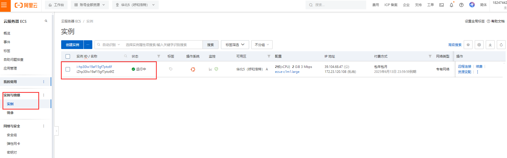
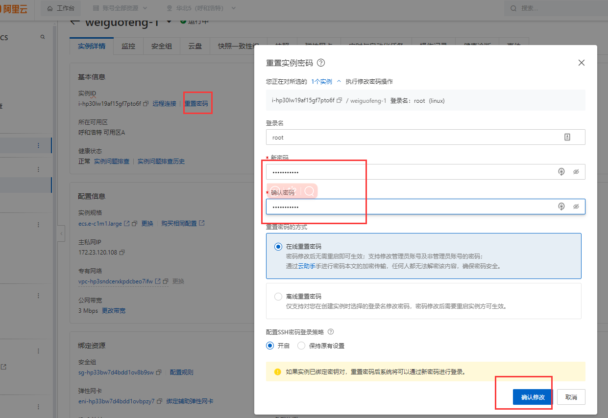
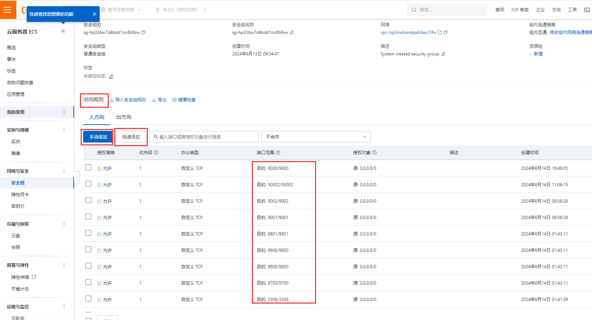

```
title: 阿里云服务器
date: 2024-06-12
```


# 26、阿里云服务器购买配置

​	https://ecs.console.aliyun.com/server/region/cn-hangzhou#/


#### 1、实例创建

​	显示已购买的实例





#### 2、密码重置





 然后我们现在就可以使用 xshell进行连接了


#### 	2、安全组问题

​		如果需要开放端口--那么安全组添加端口配置即可





