# 27、什么是Ansible？

​		为什么我们需要Ansible？我们从linux系统管理员的角度来看它，所以我可能有一台需要管理的服务器，管理这台服务器非常容易，例如可能更改DNS服务器，那么我们需要做的就是更新etc解析conf文件更新一个文件，那么如果需要管理更多的服务器，如果我们一台一台的进行操作和管理那么就太浪费时间了，因为这些操作都是一样的。

​	那么Ansible的用武之地就是来处理这类问题，用Ansible检查一下，我会建立一个服务器，这个服务器上面有Ansible在运行，我会让它成为我的主站也就是控制站，这是我的指挥中心，在这里我可以让所有的发生在我进行控制的地方，那么如果我需要更改所有服务器上的DNS服务，我可以在我的控制站点上进行更改，解决了我们对每台服务器进行的重复的更改操作。

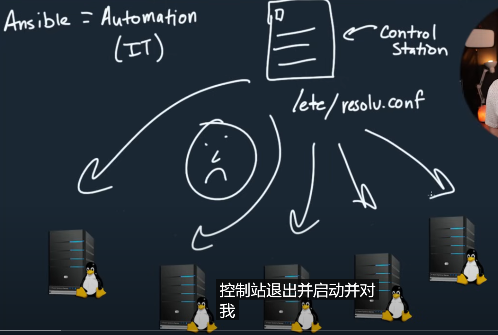


​		Ansible是基于Python开发的，这使得它特别酷，而且它无代理，这通常意味着什么？进行自动化，你的自动化工具要求你在机器上安装某种代理或客户端，现在很多情况下这是不可能的，特别是对于网络工程师来说，因为我们有Ciso IOS的路由器，不允许操作这些路由设备，所以我们无法使用那些需要代理的系统来管理它，但是使用Ansible它是无代理的，它只需要通过SSH连接并运行命令，这太棒了。


​		Ansible不只是管理Linux，可以是AWS，可以是Windows，你可以管理你的整个基础设施，而且它是免费的。


​		我们可以安装在任何Linux发行版上，甚至是MacOS上，为什么是免费的，因为它是开源的，当然也有付费的般本。

​		Ansible本身是令人惊讶的，就它如何与机器以及在路由器，交换机和控制中交互而言，它绝对是一种推送模型，它非常有推动力，你有拉动和推送模型，这个将配置推送到设备，推送命令。


#### 	1、前置准备

​		我们需要三台服务器，其中一台服务器将成为控制台或者是控制者，另外俩个将是被控制的。


#### 	2、Ansible的安装

​		脚本安装---目前是CentOS系统

```

	yum update -v
	
	yum install epel-release -y
	
	yum install ansible -y
	


```


​		进入Ansible目录 /etc/ansible

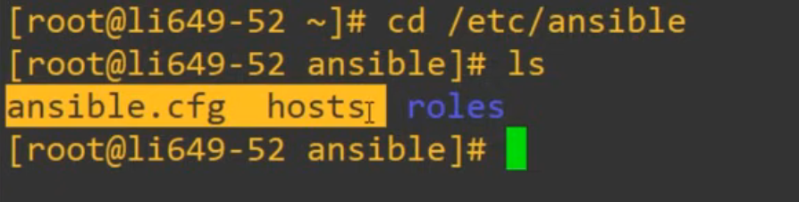

​		现在我们关心的是ansible.cfg 和hosts

​		ansible.cfg -- 这个是ansible的配置设置

​		hosts -- 这个是包含我们要控制的事务列表，通常称为清单文件

​				就像一个清单一样，会列出你控制所有的Linux机器的所有内容


​	现在我们编辑这个hosts文件，配置它实现管理另外俩台服务器

​	到文件的底部进行编辑

​			配置IP和用户名密码

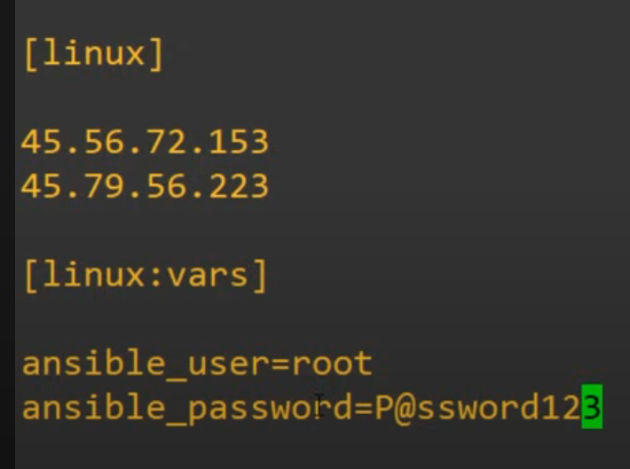


#### 	3、配置ansible.cfg

​			我们需要修改一个选项，主机秘钥检查host_key_checking =False

​			这个配置通常在ansible和生产环境中，你将使用SSH秘钥检查主机，这对我们来说非常安全，我们只是在进行实验，因此我们将禁用此功能

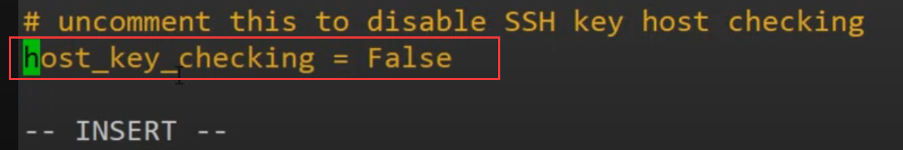


#### 	4、Ansible命令

​		可以通过指定ip地址来指定一台主机，或者我们可以指定我们hosts中的 Linux组

​		-m 代表模块

​		ping  命令

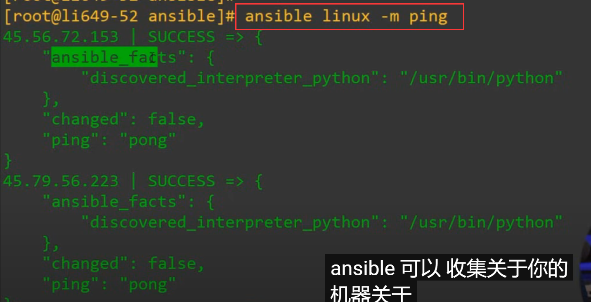

​		

​	现在我们尝试输入常规的Linux命令，在管理的另外俩台设备上执行

​		我们看一下服务器的操作系统版本

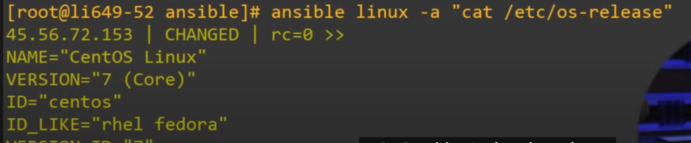

​	我们可以看到俩台服务器都执行了这个命令，可以看到俩台服务器的信息


​	我们重启一下看看什么效果  俩台机器是否都会重新启动

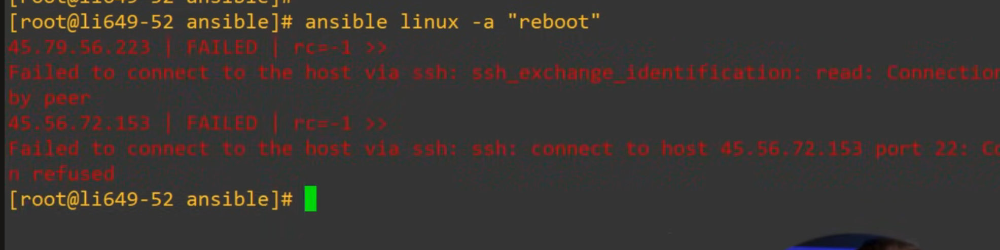

​		可以重新启动，重新启动连接断开，所以报红


​	我们现在只是使用的Ansible的临时执行的命令，但是有更强大的使用Ansible的方法，那就是通过使用称为playbook的东西

​		使用playbook将会更有组织性， 一个yaml文件

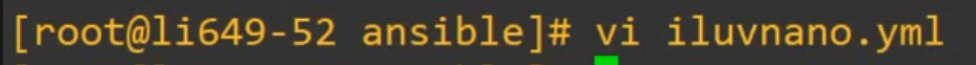

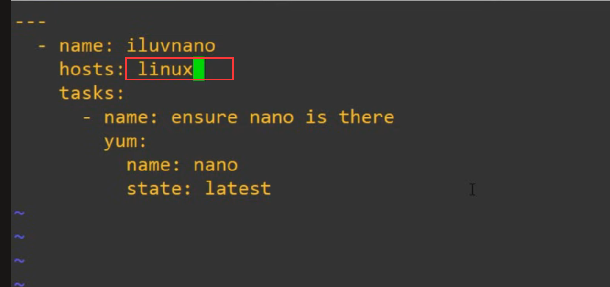


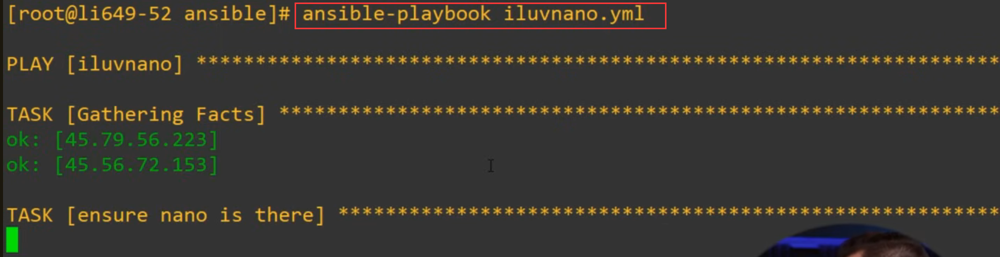


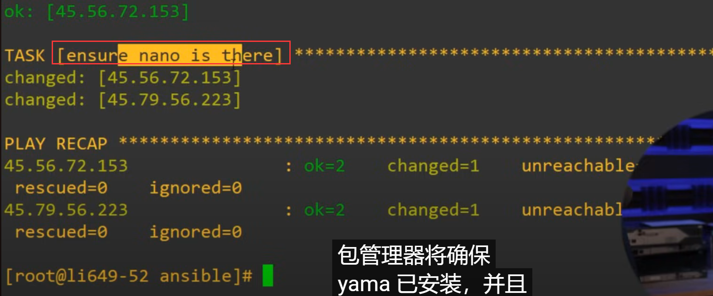

​			现在这个Ansible就帮助我们在俩台服务器上都安装了anno


​	我们再次运行看看什么效果：

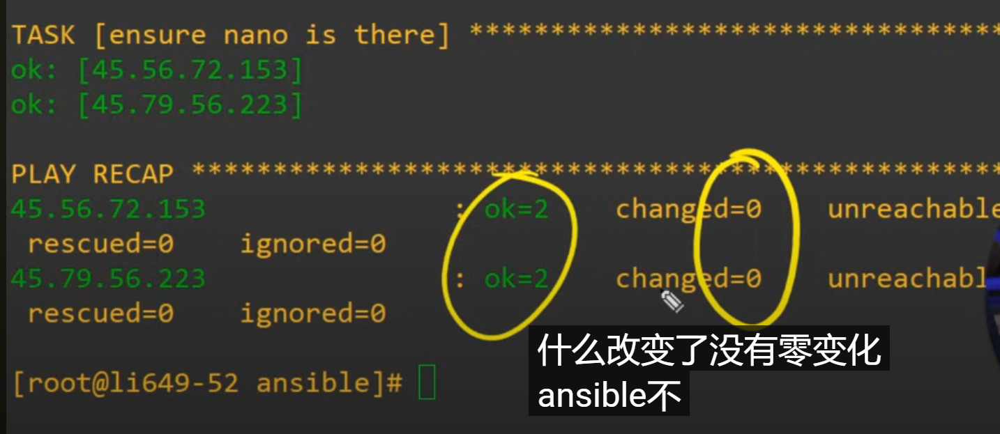

​	changed是0，因为我们之前已经安装过了，所以再次执行这个没有变化


​	我们修改yaml文件，将版本设置为不存在的般本

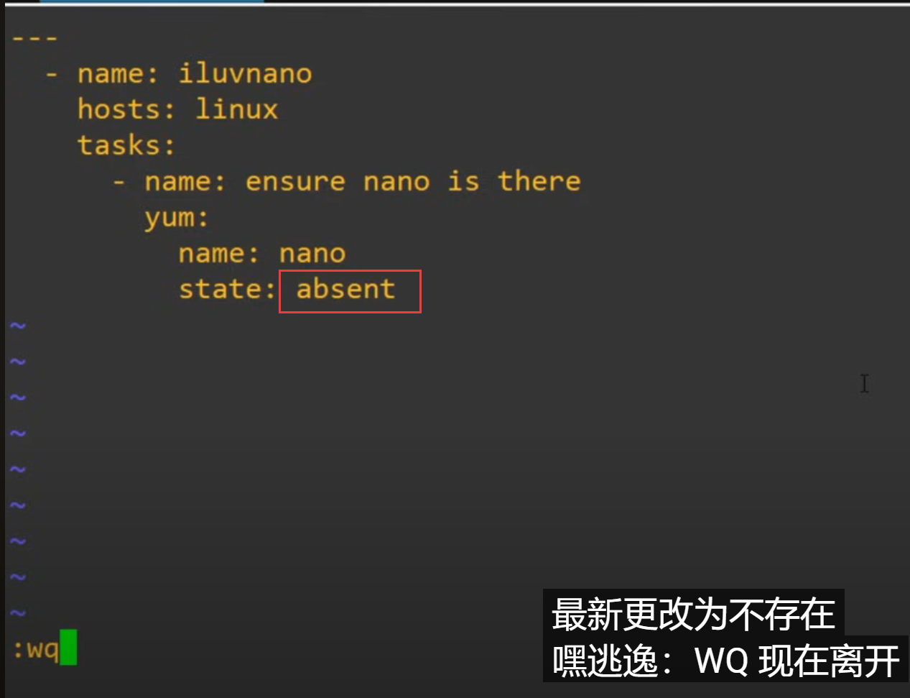


​	然后再次执行测试：

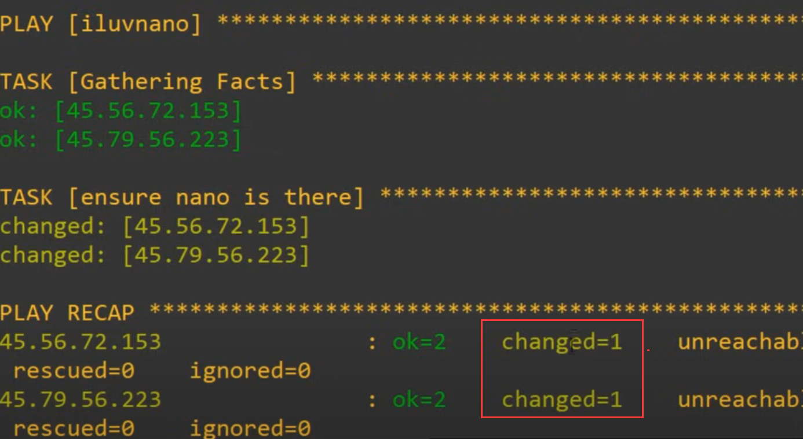

​	change 发生变化，


#### 	5、更多的模块

​			更多的需要实践探索

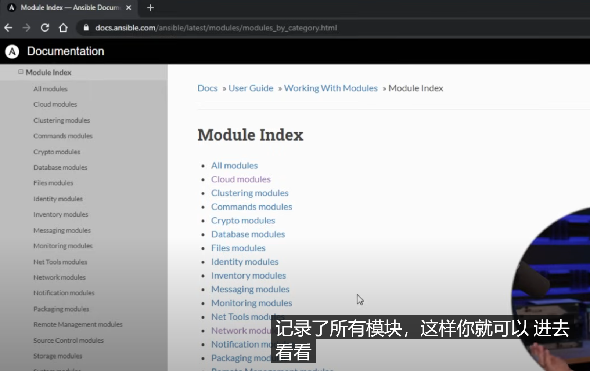


​		


https://www.youtube.com/@NetworkChuck/playlists


