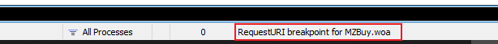

# 6.tiktok抖音安装

**准备工作：**

1个美区苹果ID：可在站内或者频道搜索，有教程！

1个小火箭账号：购买地址：[https://xiaohuojian8.com/aff/2332.html](https://www.ayangcc.com/go?_=0dd0633be1aHR0cHM6Ly94aWFvaHVvamlhbjguY29tL2FmZi8yMzMyLmh0bWw%3D&amp=1)

爱思手机助手：[https://www.i4.cn/](https://www.ayangcc.com/go?_=755f766f4baHR0cHM6Ly93d3cuaTQuY24v&amp=1)

FiddlerSetup（旧版软件下载工具）：[https://url04.ctfile.com/f/35852404-554435649-0b9f9b](https://www.ayangcc.com/go?_=0b86a15978aHR0cHM6Ly91cmwwNC5jdGZpbGUuY29tL2YvMzU4NTI0MDQtNTU0NDM1NjQ5LTBiOWY5Yg%3D%3D&amp=1)（访问密码：2396）

**详细视频教程地址**：[https://youtu.be/zFVLP9PE67c](https://www.ayangcc.com/go?_=70e6c961f5aHR0cHM6Ly95b3V0dS5iZS96RlZMUDlQRTY3Yw%3D%3D&amp=1)

#### 1、我们先安装好爱思助手

#### 2、然后安装FiddlerSetup抓包工具

好了准备工作完毕

#### 3、配置fiddler

点击Tools下的Options

点到HTTPS 然后 勾选Decrypt HTTPS Traffic

​		这里可能会弹出需要安装证书，然后点击YES就可以了

我们目前是没有弹出，所以需要点击checks检查证书

​	check勾选--然后Actions---》Trust Root Certificate（信任的根证书）

然后点击YES

然后弹出证书的信息--点击是

最后点击ok就可以了

#### 4、爱思助手的操作

点击智能刷机

然后我们需要安装一个旧版本的iTunes

​	直接下一步安装就可以

打开Itunes选择账户 --登录

​		这边要美区的ID weiguofeng123@gmail.com

ssr服务地址14.29.124.174

端口21647-----密码QazEdcTgb159@$*

加密协议ase-128-cfb

我们在确认一下版本--12.6.5是旧版没问题

然后会转入美区

搜索tiktok

先不要下载，现在我们打开fiddler抓包工具

​	我们现在复制一下代码

代码：
bpu MZBuy.woa

在最下面的控制台输入代码命令

可以看到这样一串英文--这个意思就是在这里进行了一个**断点**

然后我们就可以开始下载了--点击下载

然后断点截住了--我们需要替换他的版本号

我们替换为以下2个版本号都是可以的

TikTok版本号：21.1.0 版本ID：844024073
TikTok版本号：21.1.0 版本ID：843972181

直接编辑替换就可以了

点击这个绿色的按钮

我们现在看一下他是否在下载--如果下载不成功就重复操作一遍

然后下载完成后--我们可以右键--显示简介 看到大小是213.9的 版本是21.1.0及以下的版本才可以

然后我们复制路径找到ipa文件

C:\Users\Lenovo\Music\iTunes\iTunes Media\Mobile Applications\TikTok 21.1.0.ipa

将这个文件拖入桌面

然后我们现在使用数据线连接电脑---

​	我的设备--应用游戏--导入安装的ipa文件

开始传输了

#### 配置小火箭

​	点击配置---》配置--看到个本地文件，点击纯文本编辑--》

​		拖到最下面--复制下面的代码，然后粘贴进去保存

​	接着-还是选择本地文件--》编辑配置--》选择HTTPS解密--》

下载证书

**下面是在小火箭里配置的代码：**

[URL Rewrite]
(?<=_region=)CN(?=&) JP 307
(?<=&mcc_mnc=)4 2 307
^(https?:\/\/(tnc|dm)[\w-]+.\w+.com\/.+)(\?)(.+) $1$3 302
(^https?:\/\/*.\w{4}okv.com\/.+&.+)(\d{2}.3.\d)(.+) $118.0$3 302

[MITM]
hostname = *.tiktokv.com,*.byteoversea.com,*.tik-tokapi.com

**温馨提示：改地区只需要把上面的配置代码 第二行的JP 307 里的JP，改为你需要的地区保存即可，比如US，SG，KR,等等**！

