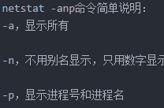
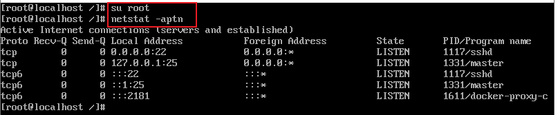
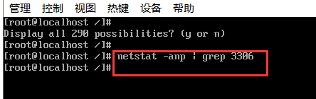
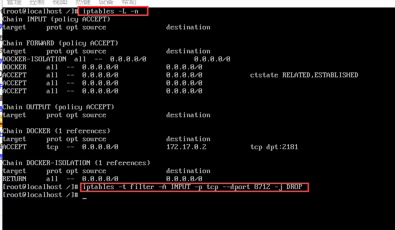
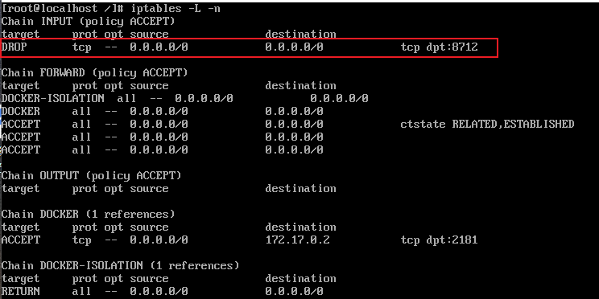

# 7.关于Linux关闭端口的问题


  首先 关闭端口这个操作：什么情况会用到？

```
	可能为了安全--防止通过这个端口进行攻击，还有我们不希望通过这个端口的开放进行访问
	
	可能这个端口存在所部署应用的bug，如果需要立即排除bug，权衡进行代码的修复或者的停用服务或者是关闭掉某个端口
```


​	我们一般在关闭端口前的操作是，先查看一下这个端口是什么应用




使用命令 netstat -aptn 查看所有端口

​	a:全部，p：programs程序，t：tcp的传输协议，n：直接使用ip地址，而不通过域名服务器




比如我们寻找8712这个端口，如果没有可以单独查看一下

```
netstat -anp |grep 3306 //查看某一端口的连接客户端IP 比如3306端口
```


如果没有显示--说明没有使用这个端口




如果找到有显示，要么直接Kill掉这个进程

要么就是通过防火墙卸载这个端口

kill -9 PID 


## 通过防火墙限制端口

首先查看一下iptable规则，

-L 是：查看详细信息     -n是显示ip 


iptables -t filter -A INPUT -p tcp --dport 8712 -j DROP


-t 是操作匹配包的表 ，filter是默认的表 -A是 追加（加到末尾），INPUT输入 ，-p tcp是：适用协议tcp

-j是处理方法，如ACCEPT接受， DROP丢弃， REJECT拒绝





现在我们执行完之后再次查看

iptables -L -n

​		看到多了一条8712端口被丢弃了




```
iptables常用的命令选项有：
-P:设置默认策略的（设定默认门是关着的还是开着的）如：iptables -P INPUT (DROP|ACCEPT)
-F: FLASH，清空规则链的(注意每个链的管理权限)
-N:NEW 支持用户新建一个链,比如：iptables -N inbound_tcp_web 表示附在tcp表上用于检查web的。
-X：用于删除用户自定义的空链
-Z：清空链
-A：追加
-I num : 插入，把当前规则插入为第几条
-R num：Replays替换/修改第几条规则
-D num：删除，明确指定删除第几条规则
-L：查看规则详细信息，比如"iptables -L -n -v"
-s 表示源地址IP
-d 表示目标地址IP
DROP 表示丢弃(拒绝)
ACCEPT 表示接受
-p 表示适用协议,如tcp


```


详细查看地址：

https://zhuanlan.zhihu.com/p/54194634


