# 8.如何使用mock进行单元测试


**为什么要使用mock？**

​		我们使用mock的目的就是 可以模拟一些数据，然后对我们的程序进行测试

​	比如我们的这个测试是需要调用远程接口拿到数据进行下一步逻辑操作的，而我们现在并不能在开发环境调取这个接口，那么我们就需要模拟生产环境，然后进行对程序的单元测试。


**大家是否有了解 TDD，BDD，DDD**

**TDD**：就是我们常说的 **测试驱动开发**

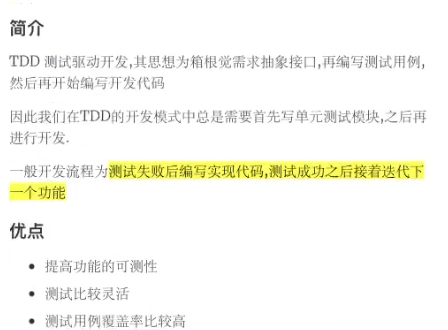

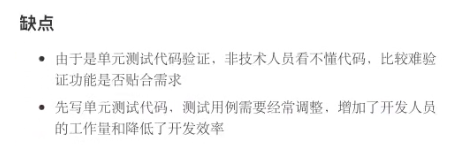

​	就是在编写代码之前，我先把测试用例告诉你，然后你现在根据这些用例呢，告诉我最终的结果，必须是和我想象的那个结果，和拿到的那个结果是一致的，就是测试先行，


**BDD：是行为驱动开发**

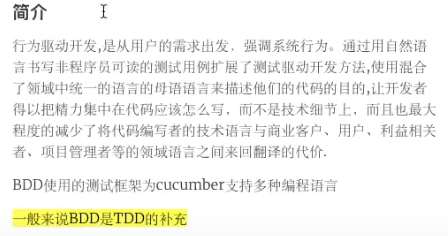


**DDD：领域驱动开发**


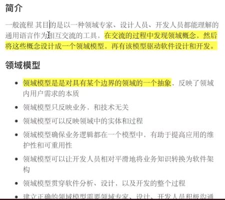

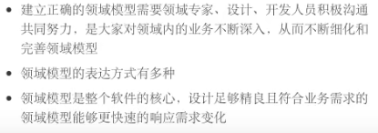


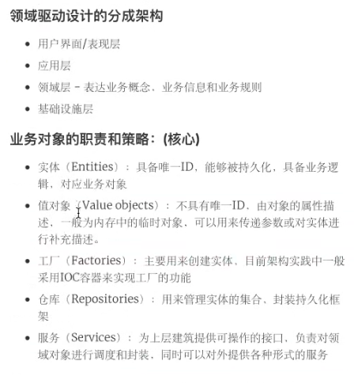

​		DDD我们不太去关注测试的点，我们会更关注业务层

​			会具体的定义几个模块--而这些模块具体要完成那些功能呢，是需要我们把他写出来的，分成架构，然后我们会对这些业务对象进行**专业的术语** 实体、值对象。。。来完成一些划分


**但是无论是TDD，BDD，DDD我们最终一个业务的开发，项目开发完之后，肯定还是要进行单元测试的**

​		其实mock就是TDD测试驱动开发产生的


### mock的使用

 -先说一下各个包的关系biz是业务逻辑，Biz会依赖调用Client，Client会依赖Service

​	Req是返回包装类，Res是请求包装类


我们现在就是想模拟一下Biz下的getFile这个接口，**注意使用mock要在test下的包路径都一致哦**

​		可以如下在类名称上alt enter --Create Test 会自动生成单元测试路径

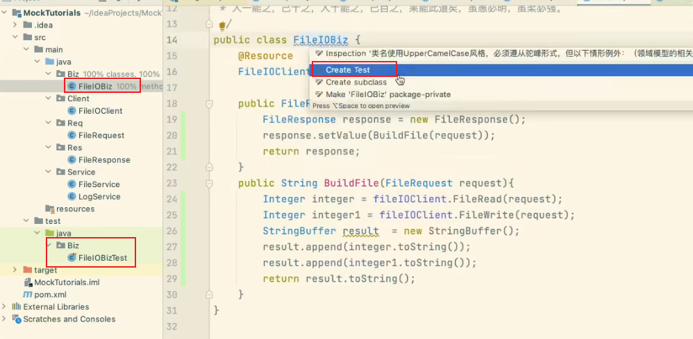


#### 第一步

@RunWith里面的参数就是会加载一些上下文的配置，或者是说加载一些必要的使用这个框架的应用，必须把这个加上才可以完成相关的mock

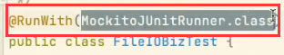


​	因为我们要测试这个FileIOBiz这个对象，所以先把这个对象先写出来，然后加上@InjectMocks注解（**修饰被测试类--要求必须是类不能是接口**），加上后就代表这个东西可以被打桩


​		然后就是@Mock代表这个对象可以被Mock

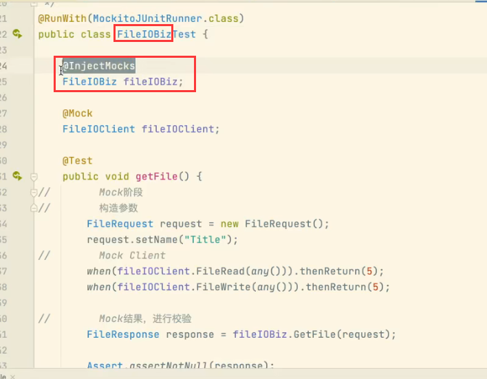


​	因为我们mock了 FileIOClient 这个对象，那么凡是这个对象需要的参数 我们都需要给他mock

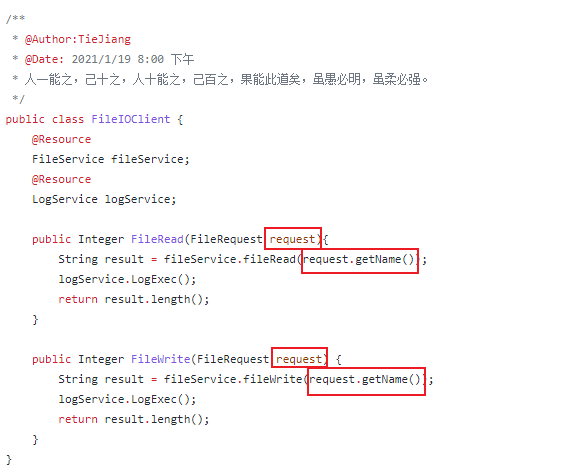


​		我们看到他使用到的参数就是request对象，对象中包含name

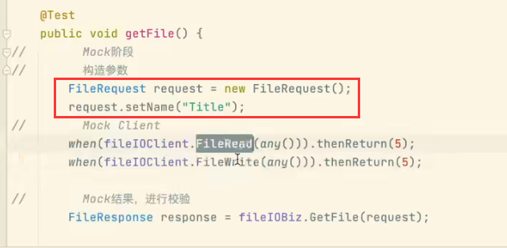


然后我们看到FileRead方法还会调用FileService，所以这个方法也需要mock掉

```java
when(fileIOClient.FileRead(any())).thenReturn(5);
	这个意思就是我在调用fileIOClient.FileRead这个方法的时候 any()无论传入的是什么参数，thenReturn(5)返回的结果都是5
	
    
```


查看一下业务逻辑：因为我们只关心这一层的逻辑，具体底层的逻辑由底层的单元测试，我们将这一层的业务正规mock就可以了

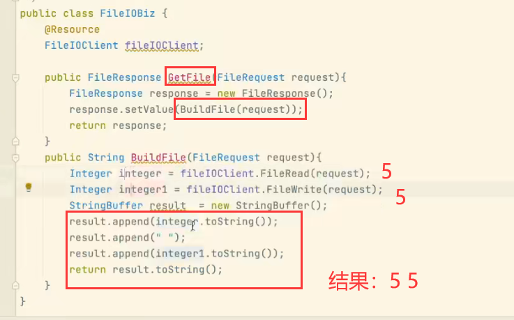


然后我们的断言是GitFile方法返回的结果不为null，还有就是返回的结果值是5 5 

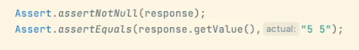


现在我们测试一下：

​	Coverage会显示一个覆盖率和是否通过

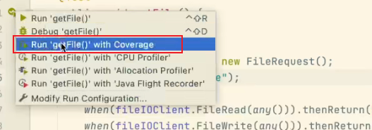

已经通过了-覆盖率是100%

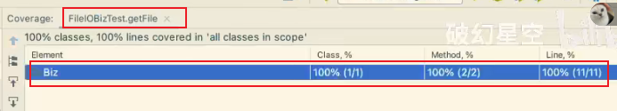


可以看到绿色的就是被测试覆盖到了

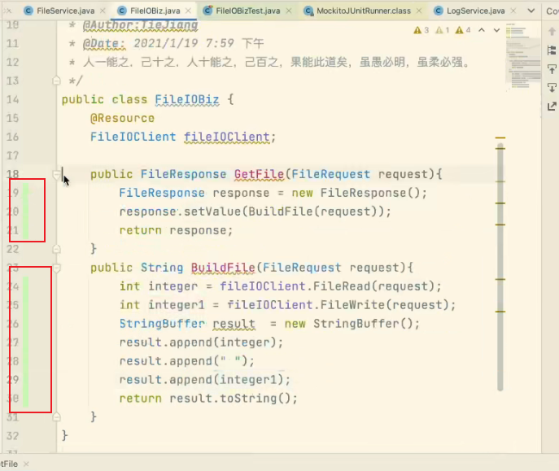


#### 使用mock的意义就是，帮助后端关注自己的逻辑，还可以帮助安卓方面进行完全分离的开发


代码地址：https://github.com/OriKey/MockTutorials/blob/master/src/main/java/Client/FileIOClient.java


