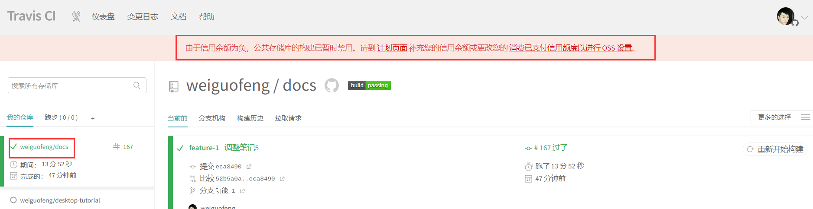

# 9.TravisCI到期了怎么办

​	我们在使用TravisCI进行项目的自动化构建时，每次都会消耗一定的积分，因为现在Travis不是免费的一共给10000的积分，所以导致我们后续会因为积分不足的情况无法重新构建

	#### 解决办法

​	1、付费--显然是不太合适的包月69美元，25000的积分是15美元，还是太贵了、

​	2、替代方案：我们可以选择[Circle](https://zhuanlan.zhihu.com/p/339916145?ivk_sa=1024320u)、也可以使用Github Action

