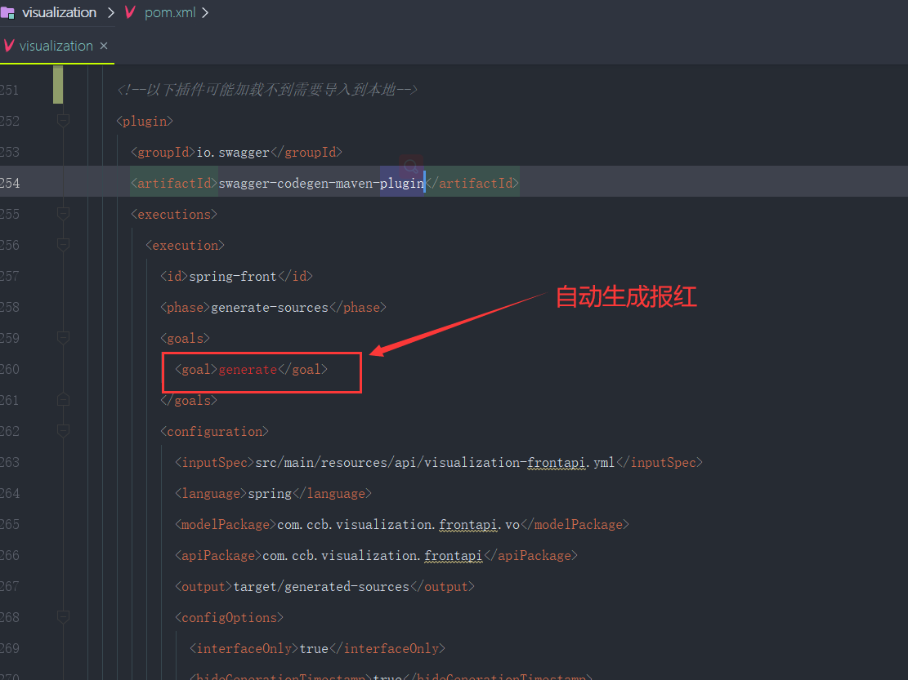

# 可视化项目本地启动的问题


#### 1.首先是项目依赖问题

```
	很多的包都是从内部私服下载的，而且还有父工程，这就导致我们拿到本地如果没有依赖项目是运行不起来的，而且pom会有大量的报错，无法加载到这些包
	
	比如：以下这些包---需要将这些包的依赖都拷贝到我们的maven本地仓库
	<!--需要加载到本地-可能加载不到-->
  <parent>
    <groupId>uyun.whale</groupId>
    <artifactId>parent</artifactId>
    <version>1.4.8</version>
  </parent>
  
  <!--maven 可能加载不到的包-->
    <dependency>
      <groupId>de.javakaffee</groupId>
      <artifactId>kryo-serializers</artifactId>
    </dependency>
   
   <!--需要导入本地加载的包-->
    <dependency>
      <groupId>com.ccb</groupId>
      <artifactId>dcossdk</artifactId>
      <version>1.0.1</version>
    </dependency>
    
```


maven中的generate报红问题：插件报错的问题




