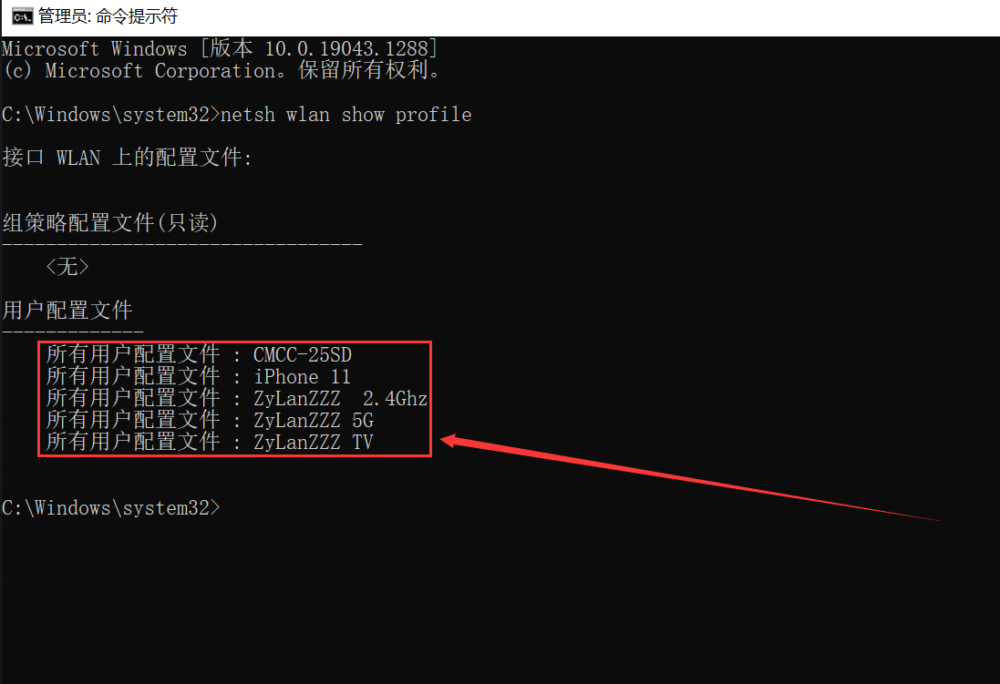

https://www.ayangcc.com/1410.html

哈喽大家好，我是阿阳，欢迎来到我的网站，我们有的时候会忘记家里的WIFI无线网络密码，方法很简单，也很有效果，不需要你们重新去路由器后台设置，只需要简单的两个代码，就可以实现，这个方法可以一键查看，任何地方都可行，那我的博客每周会更新关于网络赚钱以及福利软件分享，如果你感兴趣的话，记得收藏一下，那我们废话不多说，开始吧！

第一步，我们需要来到我们的电脑在搜索栏目里输入CMD，以管理员身份运行！

第二步，输入 **netsh wlan show profile** 回车 会得到WIFI无线网络信息

第三步，输入 **netsh wlan export profile folder=C:\ key=clear** 它就会给你保存到C盘

第四步：打开C盘 找到自己WIFI 右键用记事本打开！

上面就是你的密码了！

## CMD命令：

## netsh wlan show profile

## netsh wlan export profile folder=C:\ key=clear