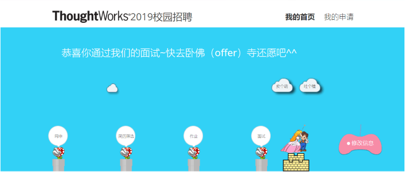

# 2018秋招

# 秋招历程流水账总结

笔主大四准毕业生，在秋招末流比较幸运地进入了一家自己非常喜欢一家公司——ThoughtWorks.

从9-6号投递出去第一份简历，到10-18号左右拿到第一份 offer ，中间差不多有 1 个半月的时间了。可能自己比较随缘，而且自己所在的大学所处的位置并不是互联网比较发达的城市的原因。所以，很少会有公司愿意跑到我们学校那边来宣讲，来的公司也大多是一些自己没听过或者不太喜欢的公司。所以，在前期，我仅仅能够通过网上投递简历的方式来找工作。

零零总总算了一下，自己在网上投了大概有 10 份左右的简历，都是些自己还算喜欢的公司。简单说一下自己投递的一些公司：网上投递的公司有：ThoughtWorks、网易、小米、携程、爱奇艺、知乎、小红书、搜狐、欢聚时代、京东；直接邮箱投递的有：烽火、中电数据、蚂蚁金服花呗部门、今日头条；线下宣讲会投递的有：玄武科技。

网上投递的大部分简历都是在做完笔试之后就没有了下文了，即使有几场笔试自我感觉做的很不错的情况下，还是没有收到后续的面试邀请。还有些邮箱投递的简历，后面也都没了回应。所以，我总共也只参加了3个公司的面试，ThoughtWorks、玄武科技和中电数据，都算是拿到了 offer。拿到 ThoughtWorks 的 offer之后，后面的一些笔试和少部分面试都拒了。决定去 ThoughtWorks 了，春招的大部队会没有我的存在。

我个人对 ThoughtWorks 最有好感，ThoughtWorks 也是我自己之前很想去的一家公司。不光是因为我投递简历的时候可以不用重新填一遍表格可以直接发送我已经编辑好的PDF格式简历的友好，这个公司的文化也让我很喜欢。每次投递一家公司几乎都要重新填写一遍简历真的很让人头疼，即使是用牛客网的简历助手也还是有很多东西需要自己重新填写。

说句实话，自己在拿到第一份 offer 之前心里还是比较空的，虽然说对自己还是比较自信。包括自己当时来到武汉的原因，也是因为自己没有 offer ，就感觉心里空空的，我相信很多人在这个时候与我也有一样的感觉。然后，我就想到武汉参加一下别的学校宣讲会。现在看来，这个决定也是不必要的，因为我最后去的公司 ThoughtWorks，虽然就在我租的房子的附近，但之前投递的时候，选择的还是远程面试。来到武汉，简单的修整了一下之后，我就去参加了玄武科技在武理工的宣讲会，顺便做了笔试，然后接着就是技术面、HR面、高管面。总体来说，玄武科技的 HR 真的很热情，为他们点个赞，虽然自己最后没能去玄武科技，然后就是技术面非常简单，HR面和高管面也都还好，不会有压抑的感觉，总体聊得很愉快。需要注意的是 玄武科技和很多公司一样都有笔试中有逻辑题，我之前没有做过类似的题，所以当时第一次做有点懵逼。高管面的时候，高管还专门在我做的逻辑题上聊了一会，让我重新做了一些做错的题，并且给他讲一些题的思路，可以看出高层对于应聘者的这项能力还是比较看重的。

中电数据的技术面试是电话进行的，花了1个多小时一点，个人感觉问的还是比较深的，感觉自己总体回答的还是比较不错的。

这里我着重说一下 ThoughtWorks，也算是给想去 ThoughtWorks 的同学一点小小的提示。我是 9.11 号在官网：https://join.thoughtworks.cn/ 投递的简历，9.20 日邮件通知官网下载作业，作业总体来说不难，9.21 号花了半天多的时间做完，然后就直接在9.21 号下午提交了。然后等了挺长时间的，可能是因为 ThoughtWorks 在管理方面比较扁平化的原因，所以总体来说效率可能不算高。因为我选的是远程面试，所以直接下载好 zoom 之后，等HR打电话过来告诉你一个房间号，你就可以直接进去面试就好，一般技术面试有几个人看着你。技术面试的内容，首先就是在面试官让你在你之前做的作业的基础上新增加一个或者两个功能（20分钟）。所以，你在技术面试之前一定要保证你的程序的扩展性是不错的，另外就是你在技术面试之前最好能重构一下自己写的程序。重构本身就是你自己对你写的程序的理解加强很好的一种方式，另外重构也能让你发现你的程序的一些小问题。然后，这一步完成之后，面试官可能会问你一些基础问题，比较简单，所以我觉得 ThoughtWorks 可能更看重你的代码质量。ThoughtWorks 的 HR 面和其他公司的唯一不同可能在于，他会让你用英语介绍一下自己或者说自己的技术栈啊这些。

# 关于面试一些重要的问题总结
另外，再给大家总结一些我个人想到一些关于面试非常重要的一些问题。

### 面试前

**如何准备**

运筹帷幄之后，决胜千里之外！不打毫无准备的仗，我觉得大家可以先从下面几个方面来准备面试：

1. 自我介绍。（你可千万这样介绍：“我叫某某，性别，来自哪里，学校是那个，自己爱干什么”，记住：多说点简历上没有的，多说点自己哪里比别人强！）
2. 自己面试中可能涉及哪些知识点、那些知识点是重点。
3. 面试中哪些问题会被经常问到、面试中自己改如何回答。(强烈不推荐背题，第一：通过背这种方式你能记住多少？能记住多久？第二：背题的方式的学习很难坚持下去！)
4. 自己的简历该如何写。

另外，如果你想去类似阿里巴巴、腾讯这种比较大的互联网公司的话，一定要尽早做打算。像阿里巴巴在7月份左右就开始了提前批招聘，到了9月份差不多就已经招聘完毕了。所以，秋招没有参加到阿里的面试还是很遗憾的，毕竟面试即使失败了，也能从阿里难度Max的面试中学到很多东西。

**关于着装**

穿西装、打领带、小皮鞋？NO！NO！NO！这是互联网公司面试又不是去走红毯，所以你只需要穿的简单大方就好，不需要太正式。

**关于自我介绍**

如果你简历上写的基本信息就不要说了，比如性别、年龄、学校。另外，你也不要一上来就说自己爱好什么这方面内容。因为，面试官根本不关心这些东西。你直接挑和你岗位相关的重要经历和自己最突出的特点讲就好了。

**提前准备**

面试之前可以在网上找找有没有你要面试的公司的面经。在我面试 ThoughtWorks 的前几天我就在网上找了一些关于 ThoughtWorks 的技术面的一些文章。然后知道了 ThoughtWorks 的技术面会让我们在之前做的作业的基础上增加一个或两个功能，所以我提前一天就把我之前做的程序重新重构了一下。然后在技术面的时候，简单的改了几行代码之后写个测试就完事了。如果没有提前准备，我觉得 20 分钟我很大几率会完不成这项任务。

### 面试中

面试的时候一定要自信，千万不要怕自己哪里会答不出来，或者说某个问题自己忘记怎么回答了。面试过程中，很多问题可能是你之前没有碰到过的，这个时候你就要通过自己构建的知识体系来思考这些问题。如果某些问题你回答不上来，你也可以让面试官给你简单的提示一下。总之，你要自信，你自信的前提是自己要做好充分的准备。下面给大家总结一些面试非常常见的问题：

- SpringMVC 工作原理
- 说一下自己对 IOC 、AOP 的理解
- Spring 中用到了那些设计模式，讲一下自己对于这些设计模式的理解
- Spring Bean 的作用域和生命周期了解吗
-  Spring 事务中的隔离级别
- Spring 事务中的事务传播行为
- 手写一个 LRU 算法
- 知道那些排序算法，简单介绍一下快排的原理，能不能手写一下快排
- String 为什么是不可变的？String为啥要设计为不可变的？
- Arraylist 与 LinkedList 异同
- HashMap的底层实现
- HashMap 的长度为什么是2的幂次方
- ConcurrentHashMap 和 Hashtable 的区别
- ConcurrentHashMap线程安全的具体实现方式/底层具体实现
- 如果你的简历写了redis 、dubbo、zookeeper、docker的话，面试官还会问一下这些东西。比如redis可能会问你：为什么要用 redis、为什么要用 redis 而不用 map/guava 做缓存、redis 常见数据结构以及使用场景分析、 redis 设置过期时间、redis 内存淘汰机制、 redis 持久化机制、 缓存雪崩和缓存穿透问题、如何解决 Redis 的并发竞争 Key 问题、如何保证缓存与数据库双写时的数据一致性。
- 一些简单的 Linux 命令。
- 为什么要用 消息队列
- 关于 Java多线程，在面试的时候，问的比较多的就是①悲观锁和乐观锁②synchronized 和 ReenTrantLock 区别以及 volatile 和 synchronized 的区别，③可重入锁与非可重入锁的区别、④多线程是解决什么问题的、⑤线程池解决什么问题，为什么要用线程池 ⑥Synchronized 关键字使用、底层原理、JDK1.6 之后的底层优化以及 ReenTrantLock 对比；⑦线程池使用时的注意事项、⑧AQS 原理以及 AQS 同步组件：Semaphore、CountDownLatCh、 CyclicBarrier、ReadWriteLock、⑨ReentranLock源码，设计原理，整体过程 等等问题。
- 关于 Java 虚拟机问的比较多的是：①Java内存区域、②虚拟机垃圾算法、③虚拟机垃圾收集器、④JVM内存管理、⑤JVM调优这些问题。 

### 面试后

如果失败，不要灰心；如果通过，切勿狂喜。面试和工作实际上是两回事，可能很多面试未通过的人，工作能力比你强的多，反之亦然。我个人觉得面试也像是一场全新的征程，失败和胜利都是平常之事。所以，劝各位不要因为面试失败而灰心、丧失斗志。也不要因为面试通过而沾沾自喜，等待你的将是更美好的未来，继续加油！

