# 1.精讲实训1-石雷鹏-作文1

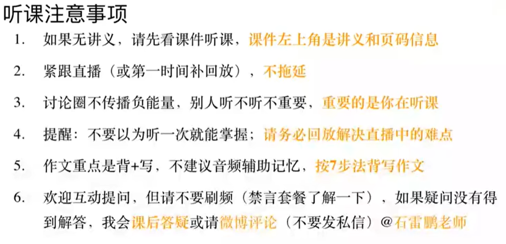

考研英语概括：

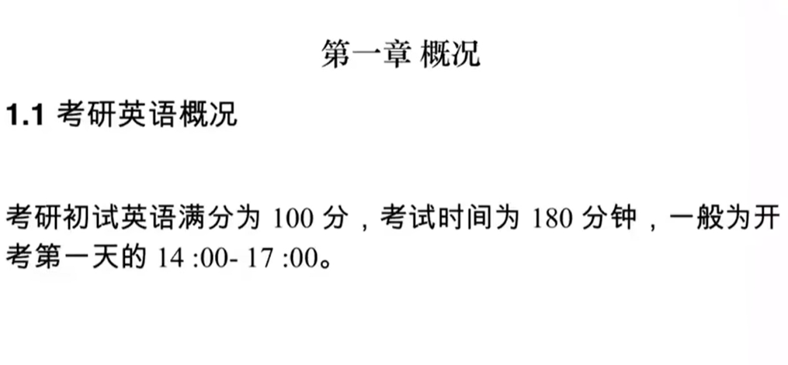

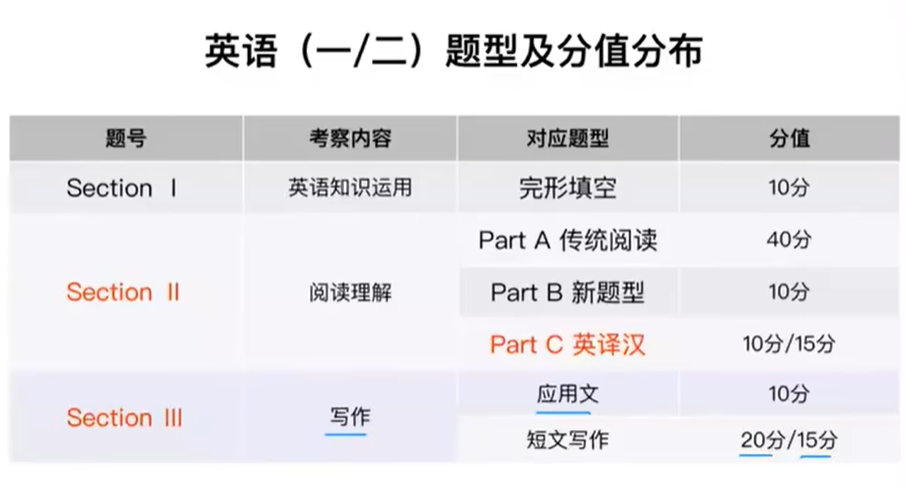

#### 1、作文的命题形式

​	例子：我们第一个要做的就是审题

​		Directions: n指令

​		目的是写电子邮件email，如果我们不知道电子邮件怎么写，就把他当做letter一封信写就可以了

​		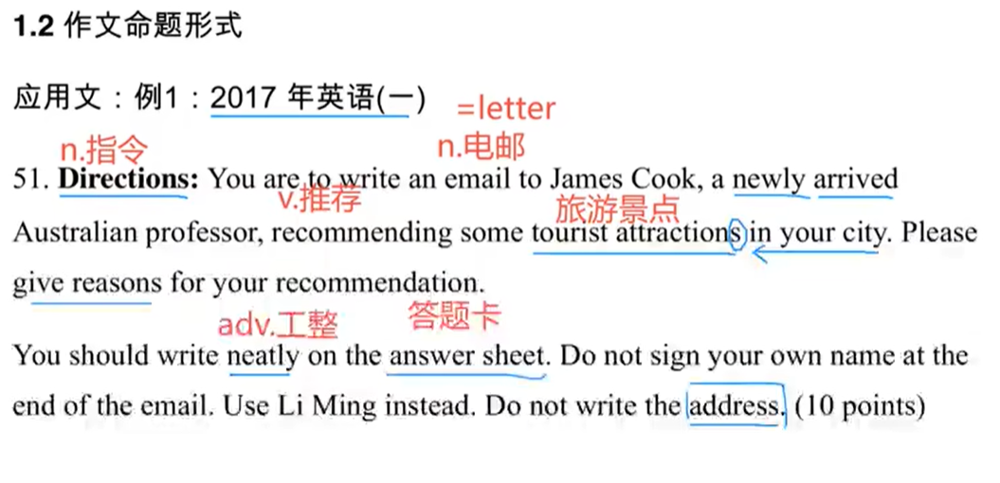

​		你应该给James Cook写一封电子邮件，给刚刚到达的澳大利亚教授，你所在的城市推荐一些吸引游客（旅游景点），请说明你推荐的原因是什么

​		你应该工整的把答案写在答题卡上，不要签自己的名字使用Li Ming来进行替换，不要写自己的地址

#### 2、例2

​	假设威廉教授邀请你去做一个展示，关于中国文化 给 一群国际学生（留学生）写一个回复

​		1.接受邀请，然后

​		2.介绍要点是什么

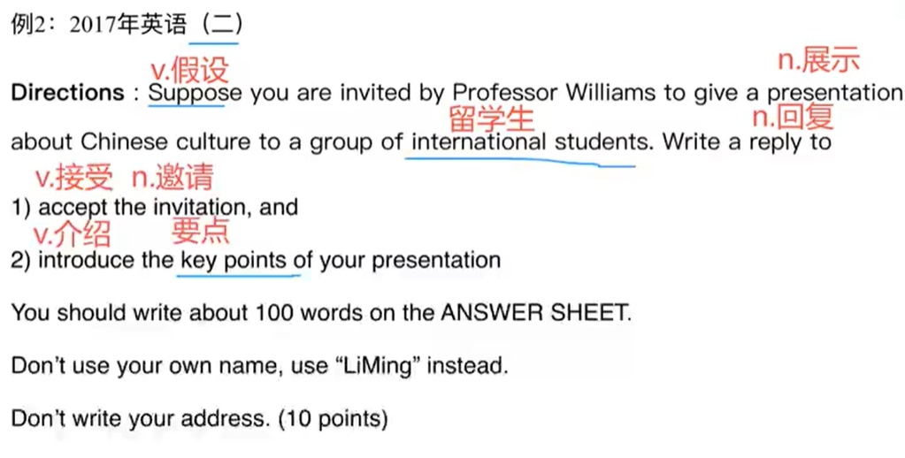

#### 3、例3

​	假设你是你所在大学的图书管理员librarian，写一封通知100个单词，给刚入学的留学生，提供一些关于图书馆相关信息。

newly是刚刚，newly-enrolled-刚刚入学

​	你应该将答案工整的写在答题纸上，不要使用自己的名字签名，使用Li Ming替换，不要写地址

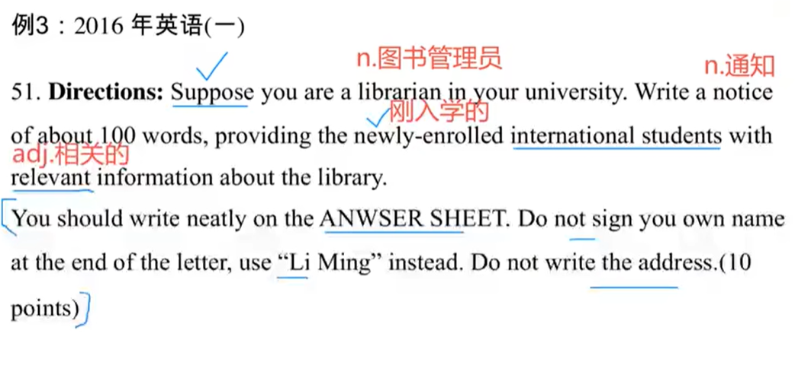

#### 4、总结

​	我们总结一下考研英语小作文常考的题材

​	 	主要还是以书信和通知为主，海报和简历假条的可能性比较低

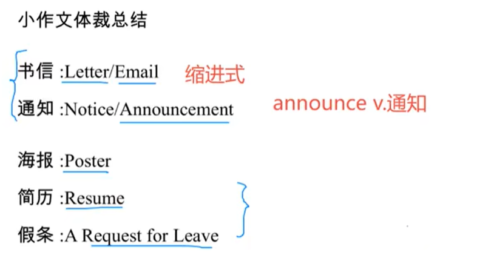

## 应用文写作

​	当我们拿到一篇应用文之后，我们应该先 审题、

#### 1、审题

​		审题三事项：题目读三遍，否则不动笔

​	读三遍就要找如下的三个东西： 1.背景--写作的背景是什么

​								2.体裁 + 内容要求 --写作的体裁是什么，要求是什么

​								3.语域--语域要求正式或非正式  + 格式---如果我们不确定正式还是非正式那就写成正式的

​									I am 就是正式，I‘m是非正式

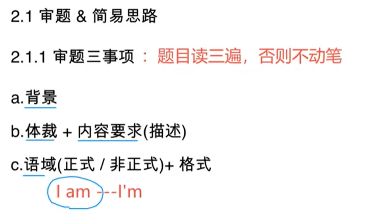

#### 2、写作思路

​	

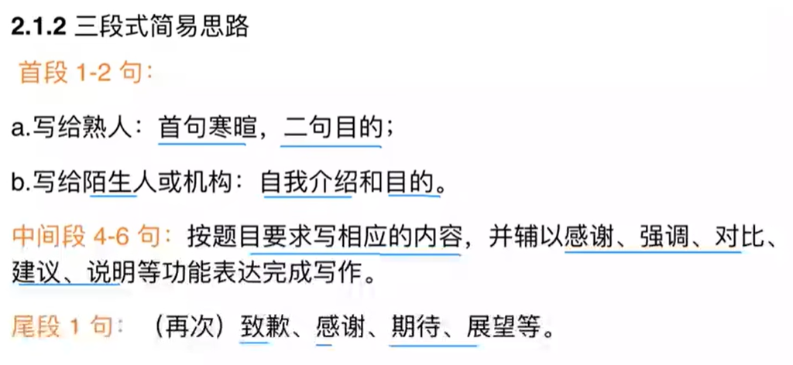

​		看了写作思路--我们还是不会，然后我们来看真题讲解与模拟练习

#### 3、应用文真题讲解，实训及模拟预测

​		2005年的作文

​		俩个月前，你找到一份工作，给《设计与时尚》杂志当编辑。但是你发现这份工作并不是你期待的工作，你决定辞职。（前三句是写作的背景---这里可以打散+改写）

​		写一封信给你的老板Mr Wang，【告诉他你的决定，陈述你的 原因，并致歉】（这就是内容要求）

​		你应该写100个单词，不要使用自己的签名，使用 li ming替换，不要写自己家的地址

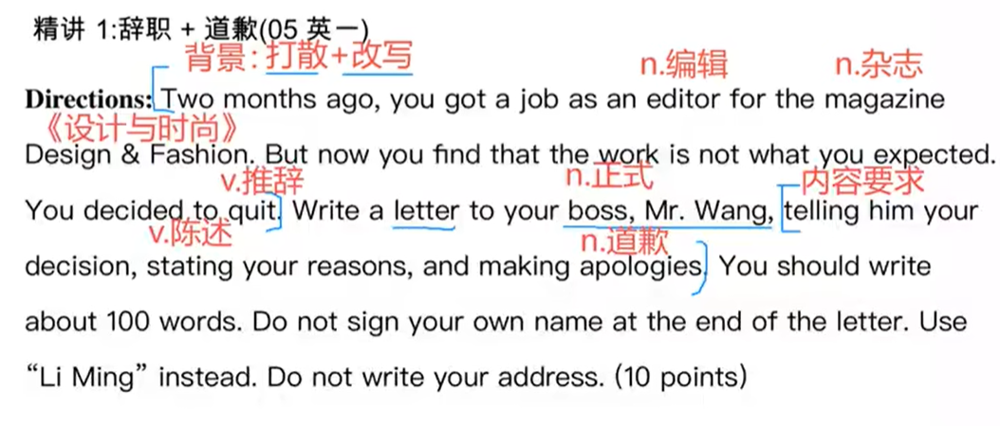

​		这样我们就审题完成了，我们在考场也应该像这样一样的审题

 参考正文--该如何写

#### 3.1	辞职案例

​		尊敬的mr Wang，

​			我很高兴 回想起过去的这俩个月，when（定语从句）在这期间 我在你们这家公司当编辑，however然而，我写这封信的目的是辞职，since因为这份工作不是我期待的工作

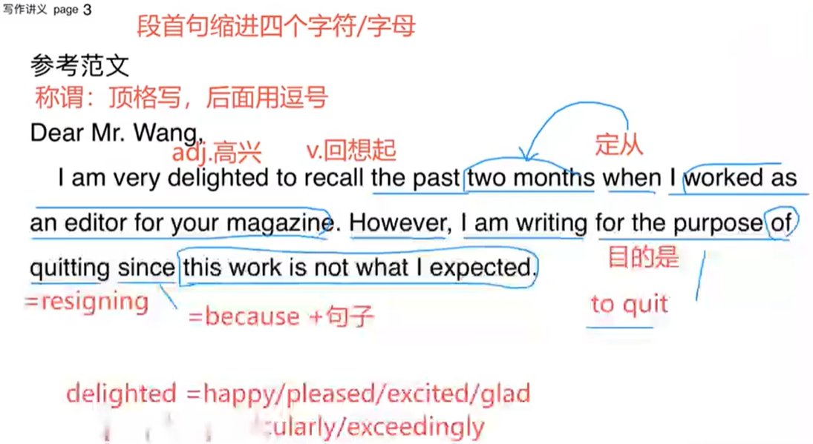

第一段就完成了，然后来看第二段

​		正是你和其他同事的巨大帮助，使得我积累了一定的能力和经验，Thus因此 我非常感谢你们对我的帮助

​	第二段：

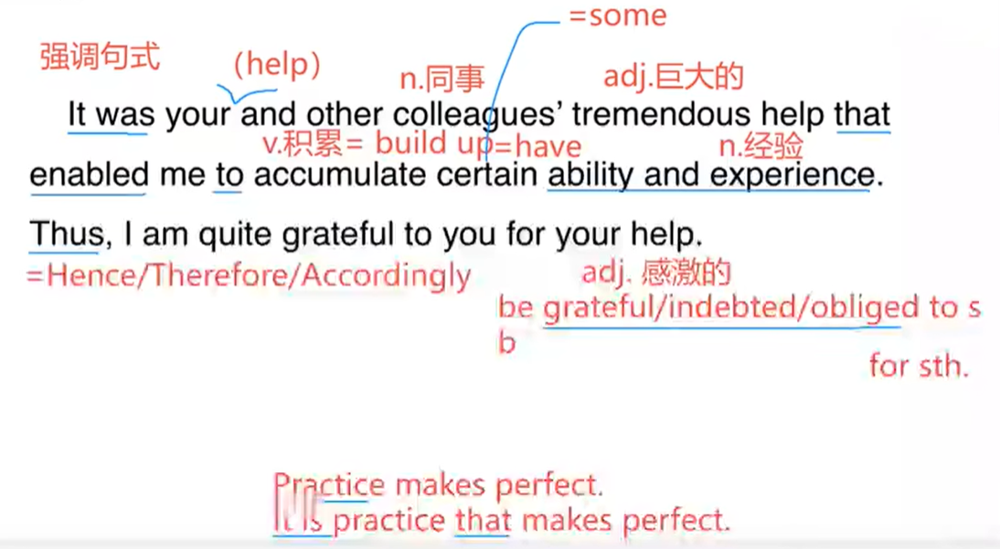

​	不管怎样，我的能力，与工作的需求相比，我没有充分的能力满足工作需求。

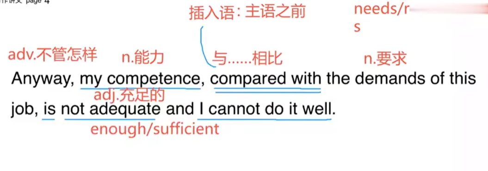

​	第二个理由：In addition此外

​			此外，我喜欢计算机科学，rather than 而不是 编辑。to conclude 总之，我不应该继续做这份工作了

​	In addition， I am keen on computer science rather than editing。 To conclude，it is not advisable for me to continue this work。 

​		或者最后一句是---我应该换一份工作 it is advisable for me to change this job for another one。

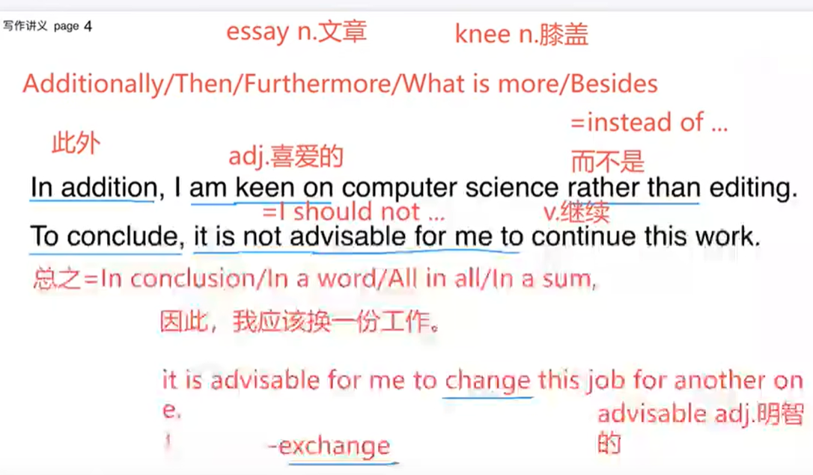

​	最后，我真诚的希望 I truly hope 你能站在我的鞋里（角度）和 接受我的道歉。

​	finally，i truly hope that you can stand in my shoes and accept my apologies

​																								落款----     your  sincerely， 你真诚的李明

​																													Li Ming

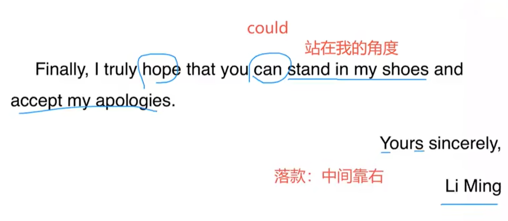

#### 3.2 道歉+建议 

​		你刚刚从加拿大回来，发现一个音乐CD在你的行李中， 这个CD是你忘记归还给Bob，Bob是你的landlord房东。（第一句话就是写作的背景）

​		1.给他写一封信----写信题材

​		2.做一个道歉

​		3.给一个建议

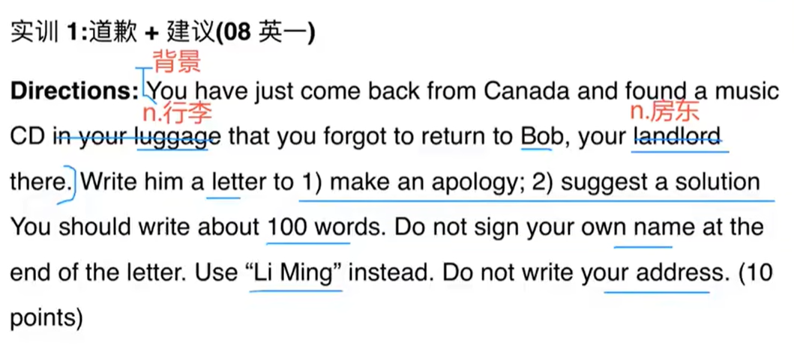

​	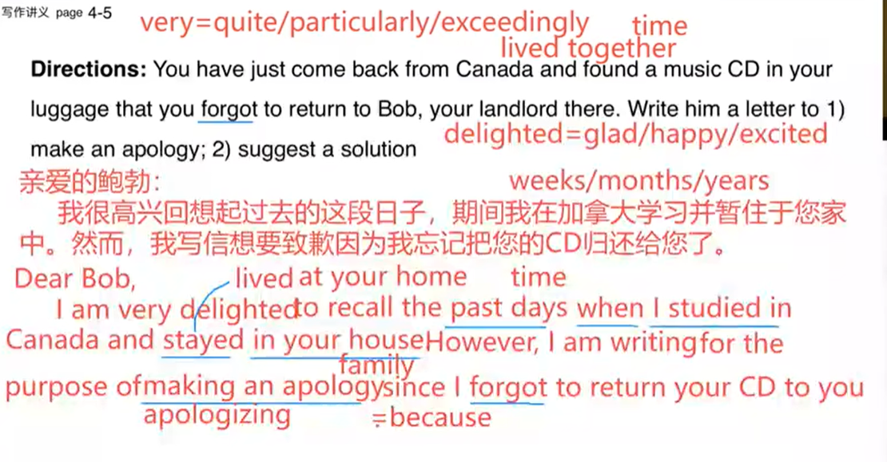

​	第一段就完成了，然后来看第二段

​		正是您巨大的帮助，使得我在贵国享受到了一段舒适并附有成果的学习之旅。因此，我非常感激您的帮助

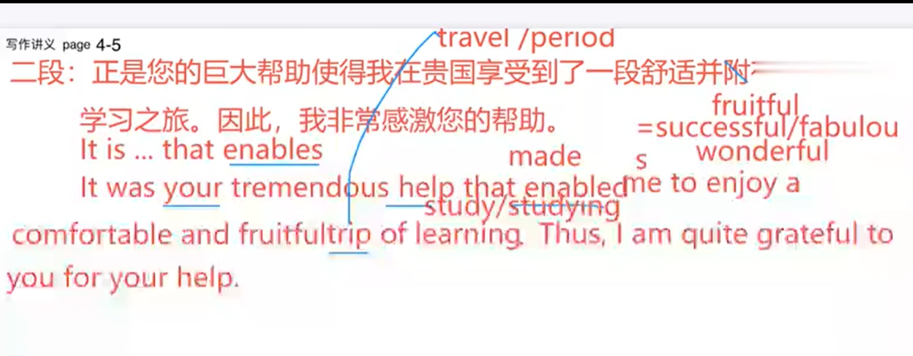

​		这里在learning后面少了一个在贵国---in your country 

​	看到1h18m

​	

​		继续往下写：

​	然而，与您相比，我更粗心，直到回到中国我才在行李中发现CD

​		Anyway，compared with you，I am more careless and did not find your/the CD in my luggage until I came back to China

​		接下来题目中要求--解决办法 suggest a solution 

​		思路是----我应该** 可以使用I should 但是最好是我们上面学的 it is 

​		因此，我应该立即把CD给您寄送回去，用EMS。 immediately立即马上

​		Thus, I deem that it is advisable for me to send it back to you immediately by EMS。

​	

​		当然，如果您能想到更好的办法，请不要不好意思告诉我    ----inform 通知，告知

​		Of course，if you can think of a better solution，please feel free to inform me。

​	结尾 1种：我期待的是在您方便的时候 能尽快给我些回复-----这个要背一下

​			I am looking forward to your favorable reply at your earliest convenience。 ---earliest 尽早

​	结尾 2种：在此期间，对您造成的不便我很抱歉。

​			Once again， I am sorry for any inconvenience caused.       ---inconvenience 不便

​																						Yours sincerely,

​																								Li Ming

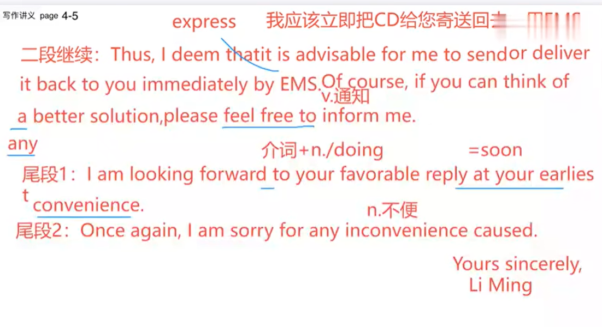

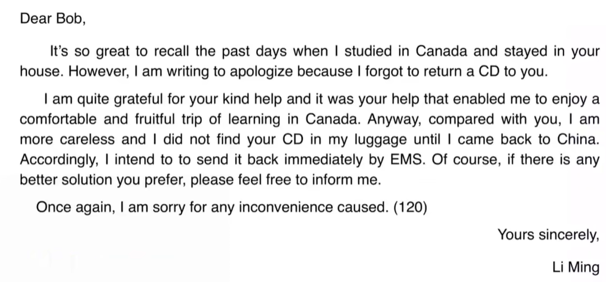

​			课程总结：1.听一遍是能够听懂，听第二遍是复习，完全懂的话是需要能够讲明白才算懂

​								2.必须得写和练习

​								3.确保做过的真题单词都认识，句子结构都清晰，正确和错误的原因自己给自己捋一遍

作业：

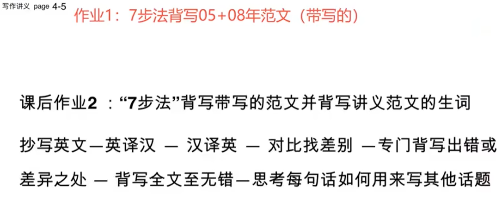

