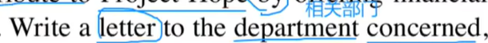
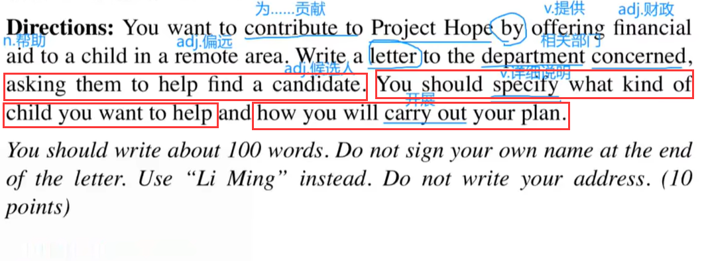
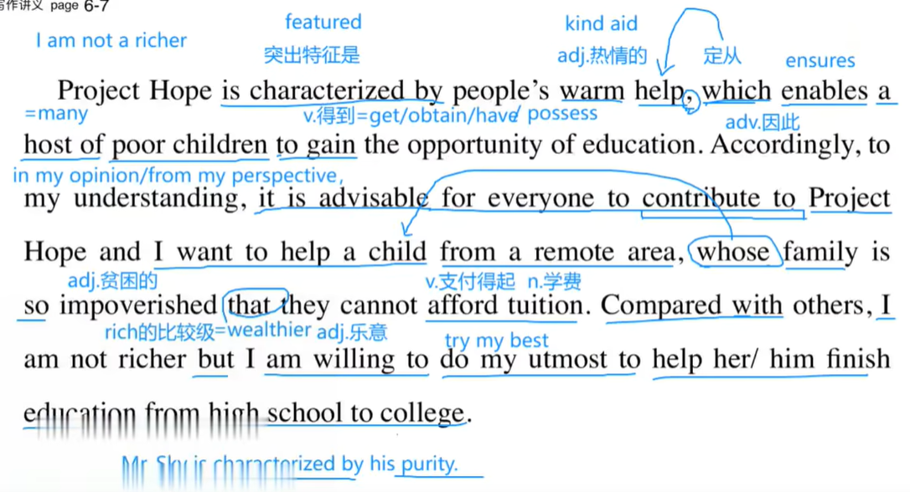
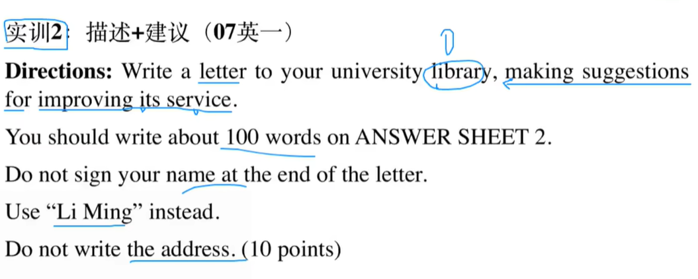
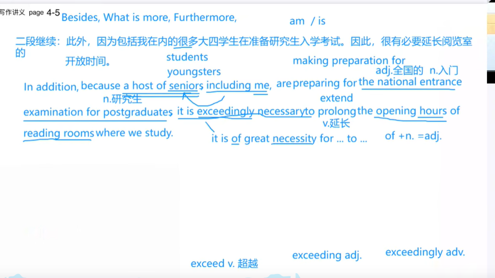

# 2.精讲实训2-石雷鹏

​		上节课我们学习了小作文该怎么写--有俩种思路

​			1.写给认识的人寒暄

​			2.写给陌生人就不用寒暄了

​		今天的作文题目 

#### 1.求助

​			contribute to 对。。。做贡献

​			project hope 希望工程

​	你想给希望工程做点贡献，通过提供财政帮助给一个在偏远地区的小孩

​		

​		给相关部门写一封信

​		请他们帮忙找一个候选人，你要详细说明一下你要帮助什么样的小孩，and并且如何开展你的计划。

​		100个单词，不要使用自己的签名，使用Li Ming 进行替换

​	分析：首先是需要写一封信给相关部门，其次是对方是陌生人，写信的目的是--1.请他们帮忙找一个候选人，2.说一下什么样的小孩，3.如何开展你们的计划

​		**如果写给陌生人---首句首先是自我介绍**

​	尊敬的先生/女士

​	Dear Sir or Madam

​		作为来自北大(Peking可省)的  who非常关注希望工程的 大四（高年级）学生，

​		As a senior in Peking University who pays greats attention to Project Hope，

​	我今天写信的**目的是** 寻找一个候选人 since因为我打算向他提供经济帮助。

​	I am writing **for the purpose of** finding a candidate since I intend to offer financial help to him/her。

​	**自我介绍 = AS + 身份 + 定从 = 使得写信人与收信人产生联系** （例如以上这句话 我们和希望工程就产生了关联）

​	**第一段：自我介绍 + 写信目的**

#### 第二段：

​	Project Hope is characterized by people's warm help，which enables a host of poor children 

​	希望工程的突出特征是人们的热情帮助，							希望工程的热情帮助使得很多 贫穷的孩子

**to gain** the opportunity of education。Accordingly，to my understanding， it is advisable for everyone

**得到**了教育的机会。									因此，			在我的理解，					每个人都应该

to contribute to Project Hope and I want to help a child from remote area，whose family 

给希望工程做贡献								我想帮助一个来自偏远地区的小孩			这个小孩的家庭

is **so** impoverished **that** they cannot afford（支付的起） tuition（学费）。 Compare with other，

是非常贫困 **以至于**他们支付不起学费。																	与其他人相比

I am not richer（rich的比较级）  but  I am willing to **do my utmost** to help her/him

我不算很有钱									但是我是乐意**尽我最大的努力**去帮助他

finish education from high-school to college。

完成从高中到大学的教育。

​	什么东西的典型特征是--- is characterized by 

​	a host of ----很多 相当于many 

​	定从俩步走：1.先写一个简单句，找重点名词

​							2.在该名词后，使用which/who/that/when/where造句，对重点名词进行补充说明

​	定从前是否加逗号：看心情--加不加都可以，如果定从和整句较长 就加逗号，如果不长就不加

#### 第三段：

​		Finally，I want to say that I am quite grateful（感激的）and  I am looking forward to your favorable 

​		最后，	我想说                   我非常感激你们的辛勤工作				我期待收到您的答复

reply at your earliest convenience。

​		在您方便的时候

​			

​																																					Yours sincerely，

​																																						Li Ming

​				你真诚的 李明

​	

#### 2、描述+建议

​		写一封信给你的大学图书馆，提建议目的是改进他的服务

​		和我们之前的三篇作文有什么差别？ 差别是题干给的字比较少，之前的三篇有背景，如果想抄题干的内容发现没法抄了，所以说题干给的内容越多这个作文就越好写一些

	#### 第一段

​	尊敬的先生/女士：

​			作为本校一名**喜欢业余时间在图书馆看书的**大四学生，我写信想要建议改进这里的服务。

​	Dear  Sir or Madam

​			As a senior in this university who prefers reading in library in the spare time, I am writing for the purpose of making suggestion for enhancing the service here

#### 第二段

​		首先，与学生在学习方面的需求相比，图书馆的图书种类和数量是不足的。我经常找不到自己想要的书。

​		To begin with，compared with student's demands in learning，the variety and quantity of books in library are not adequate and frequently， I cannot find the book I want。

 

​		因此，你们应该购买更多最新的书。

​		Accordingly，it is advisable for you to purchase more latest books.

​		

​		此外，因为**包括我在内的很多大四学生**在准备研究生入学考试。因此，很有必要延长阅览室的开放时间。

​		In addition，because **a host of seniors** including me are preparing for  the national entrance 

examination for postgraduates，it is exceedingly necessary（非常有必要） to prolong the opening hours of 

reading rooms where we study。

第三段--尾段

​	最后，我代表所有的学生，非常感激你们的辛勤工作，正是你们的帮助使得我们享受到了图书馆良好的学习氛围。

​	Finally, I, on behalf of all students, am quite grateful for your hard work and it is your help that enables us to enjoy the positive atmosphere of learning here.

尾段 版本2

​	我相信在我们共同努力下，图书馆的服务会有很大提升

​	I deem that with our shared efforts， the library service will be improved a lot。

​																					落款 	Yours sincerely，

​																											Li Ming

​	

