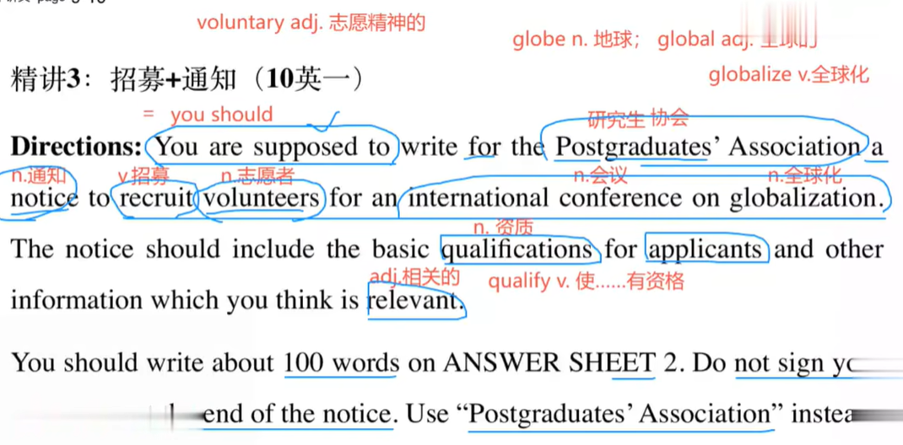
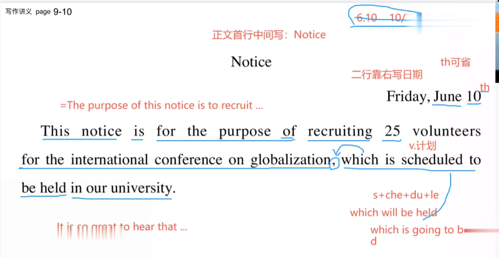
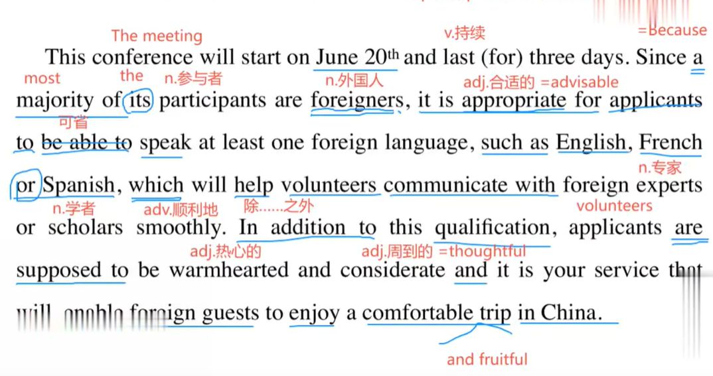
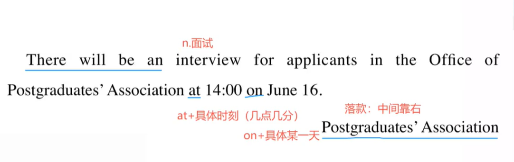
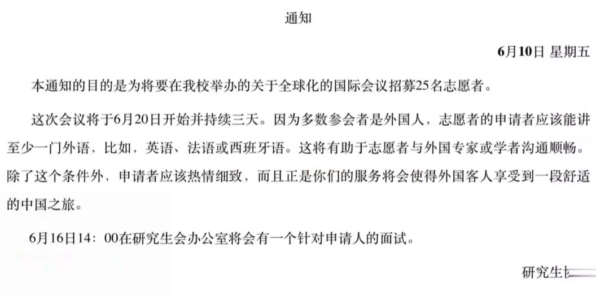
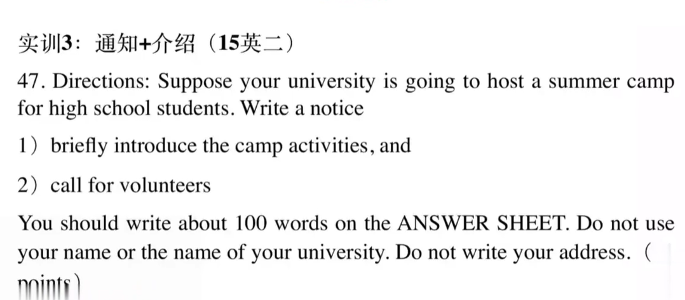
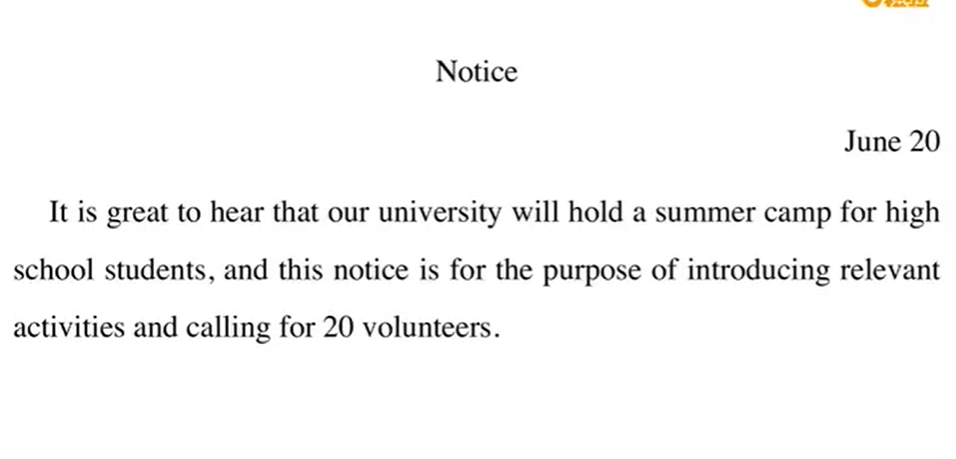
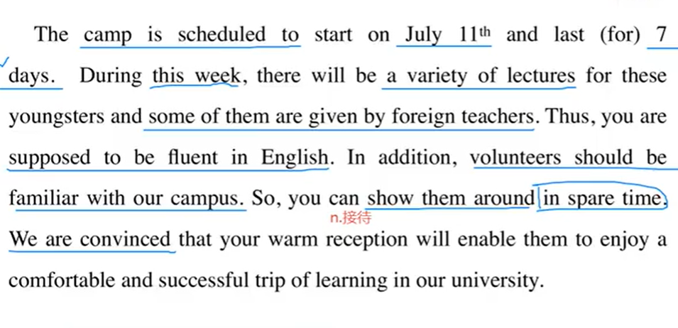
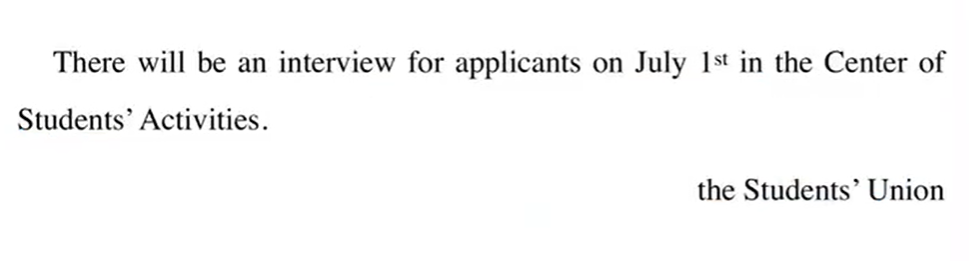

# 3.精讲实训3-石雷鹏

​	

#### 1、招募 + 通知 10年

​		指令/指示Directions：

​		You are supposed to == you should 

​		你应该写一个通知给研究生协会，招募 国际会议的 志愿者 ，这个通知应该包含申请人的基本资格（the notice should include this basic qualification for applicant）和其他你认为相关的信息（and other information which you think is relevant）

​			比如这个资格--1懂一门外语，2。热情

​		你应该写100个单词在答题卡上，2不要签自己的名字，使用研究生协会进行替换

​		通知的格式：分为**个人通知**  和   **机构通知**

​			个人通知： 通知放中间，日期在右上角，落款写个人名字，以下是个例子

​	

​	开始写正文通知

​	

#### 第一段

​	本通知的目的是 招聘 25名志愿者给国际会议，这次会议的志愿者计划在我们学校招募。

​	

#### 第二段

​		This conference will start on 20th and last for three days。 Since a majority of its participants are foreigners。

​		会议将于六月二十号开始，并持续三天。									因为多数参会人员是外国人，

it is appropriate for applicants to be able to speak at least one foreign language， such as English，

申请人应该能够讲至少一门外语，																							例如英语，

French or Spanish， which will help volunteers communicate with foreign experts or scholars smoothly。

法语或西班牙语，	能够讲好外语这    将会 帮助能够和外国的专家学者进行友好的沟通和交流。

In addition to this qualification，applicants are supposed to be warmhearted and considerate and

除了这个资质之外，							申请人应该是热心和周到的

it is service that will make foreign guests to enjoy a comfortable trip in China。

正是你们的服务将使得外国客人在中国享受一场舒适的旅行。

#### 第三段

​		There will be an interview for applicants in  the Office of Postgraduates'Association at 14:00 on June 16

​		针对面试人将会有一次面试							在研究生协会办公室6月16日的14点

​																					Postgraduates'Association

​																					落款：研究生协会

#### 2、通知+介绍

​			

​	开始审题：

​			指令： 假设你所在的大学  要主办一次针对高中生的夏令营，写一个通知

​			1、简要的介绍夏令营的活动

​			2、call for 号召志愿者

​		你应该写不少于100个单词在答题卡上，不要使用自己的名字或学校，不要使用自己的地址。

#### 第一段：

​										通知notice

​																				星期五 6月10日

​	本通知目的是                                   为定于由我校主办的一次针对高中生的夏令营号召25名志愿者。

​	This notice is for the purpose of  calling for 25 volunteers for the summercamp for high school students，which scheduled to be hosted by our university。

#### 第二段：

​		夏令营的活动主要包括：参观我们的校园，听知名教授的讲座，听相关的培训课程。

​		The camp activities mainly include visiting our campus，attending lectures by renowned professors and taking relevant training courses。

因此，志愿者应该对我们的校园是熟悉的，并且热心，周到。

Thus，volunteers  are supposed to be quite familiar with our campus，warmhearted and considerate。

第二段继续-1h29m

除了上述资质外，                                         申请人还应该具有一定的在组织活动和沟通方面的经验和能力。

In addition to the above qualifications,   it is advisable for applicants to possess certain experience and ability of organizing activities and communicating with others.

这将确保课程和讲座的成功举办。

which will ensure lectures and courses to be held successfully.

 总之，我们希望正是你们的服务将会使得这些年轻人在我校享受到一次舒适并富有成果的学习之旅。

To conclude, we hope that it is your service that will enable theses youngsters to enjoy a comfortable and fruitful trip of learning in our university.

#### 第三段

​		本次夏令营将于7月10日开始，持续约一周。针对志愿者将会在学生会办公室有个面试，6月20日的14:00。

​		The camp will start on July 10th and last for approximately one week and there will be an interview for applicants at 14:00 on July 20 in the Office of the Student Union。

​																														the Student Union

​	之前讲义上也有一篇文章

