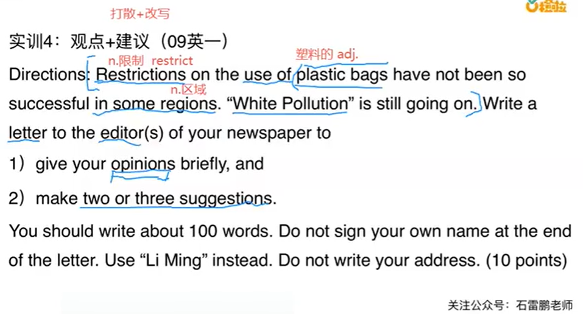
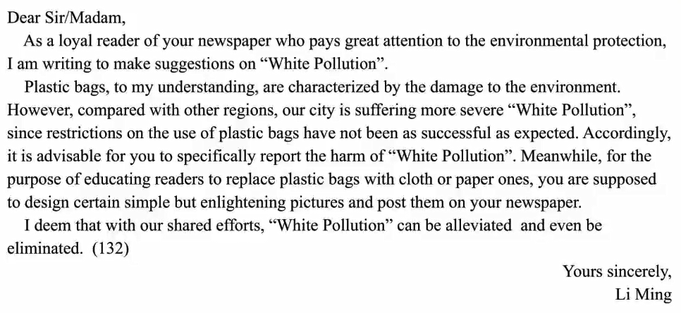

# 4.写作实训4-石雷鹏

#### 实训4--观点 + 建议 09年英语一

​	审题：

​			限制使用塑料袋这个措施在某些区域并没有那么的成功。白色污染还在继续。（背景--如果有背景可以考虑打散+改写）

​	给一家报纸的编辑写一封信

​	1.简要的说明一下你的观点 2.提出2条或3条建议

你应该写不少于100个单词，不要使用自己的名字签名，不要写你的地址。

#### 1、第一段

​			**不知道对方是谁就写先生/女士--------然后正文首先是自我介绍**

​	尊敬的先生或女士：			

​	Dear Sir or Madam，

​			作为贵报一名非常关注白色污染的忠实读者，

​			As a loyal reader of your newspaper who pays great attention to "White Pollution"，

我写信想要表达自己的观点并提建议。

I am writing for the purpose of expressing my opinions and making suggestions。

#### 2、第二段

​			----**我们谈谈白色污染的看法**

​		Plastic bags, to my understanding，are characterized by the damage to the environment。Thus，it is 

​		塑料袋，        在我看来，                                突出特征就在于其对环境的破坏。								因此，

great necessity to restrict the use of them。However，compared with the public expectation，

很有必要限制使用塑料袋。									然而，与公众的期待相比，

restrictions on plastic bags have not been so successful or satisfactory in our city。

限制使用塑料袋在我们这所城市并没有那么成功或令人满意。

Accordingly，it is advisable for your newspaper to more report  the seriousness（严重性）of  ”White Pollutio“  ，

因此，贵报更多的报道白色污染的严重层度。

which will bring readers **the awareness of environmental protection**（环保意识），

这将带给读者**环保意识**，

arouse their passion for loving environment and **help to reduce  the use of plastic bags**。

唤起他们爱护环境的热情，                                                  **有助于减少塑料袋的使用**。

In addition（此外），you are supposed to educate encourage readers to use paper bags 

此外，你们应该教育并鼓励读者使用纸袋子

or cloth bags instead of plastic ones .

或者布袋子而不是塑料袋

#### 3、第三段--结尾

​		。

​		I deem that with our shared（共同的） efforts，“White Pollution” will be reduced and even be 

​		我相信，在我们的共同努力之下，                               白色污染将会得到缓解甚至被消除。

eliminated。

​																												你诚实的李明

​																													Yours Sincerely，

​																													Li Ming

讲义--可能稍有差异

​	

