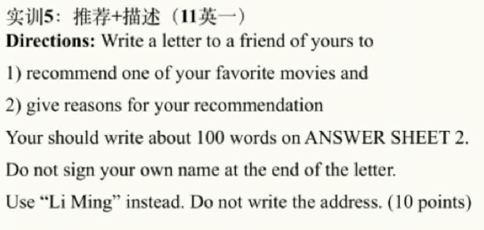

# 5.写作实训5-描述推荐-石雷鹏

​	指令：写一封信给你的朋友，1，推荐一部你喜欢的电影，2，给出推荐的原因是什么

#### 1、第一段

​	Dear Sky，

​	亲爱的石凯：

​			I am quite delighted   to recall the past month when     we went to cinema together。 Today，

​			我很高兴                           回想起上个月                                我们一起去影院的日子。              今天，

I am writing for the purpose of recommending  another one of my favorite movies --The Pursuit of Happiness

我写信想要推荐                                                           另外一部我喜欢的电影              -《当幸福来敲门》。

​			

#### 2、第二段

​		

​		This movie，to my understanding，is characterized by the wonderful plot，which attracts a host of 

​		该电影，在我看来，                          特点就在于其精彩的情节，                               吸引了包括我在内的很多年

youngsters，incloud me。  In addition，compared with other movies，the director of this movie is more

轻人。                                      此外，                 与其他电影相比，                          这部电影的导演更有名，

 famous  and actors' performance is more professional。Watching this movie can bring be power，              

​						演员的表演更专业。                                             观看这部电影带给我力量，

arouse my passion for life and help me face challenges bravely.    Thus，it is advisable for every teenager

唤起我对生活的热爱，              帮助我勇敢面对各种挑战。					因此， 每个年轻人都应该

to watch this movie.

看看这部电影。

#### 3、第三段--结尾

​		I am looking forward to discussing it with you after enjoy it。

​		我期待着看完这部电影后我们讨论一下。

​																							落款：	你真诚的 Yours Sincerely，

​																												               Li Ming

