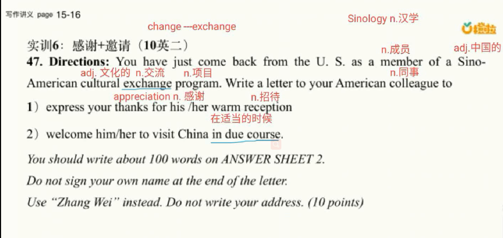
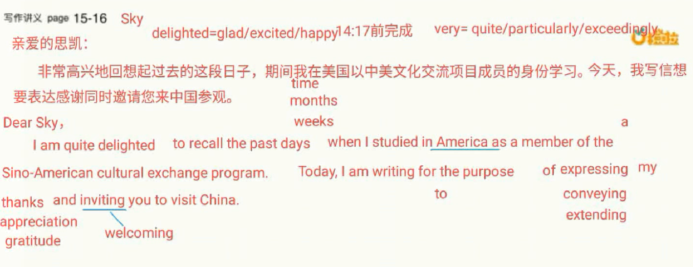
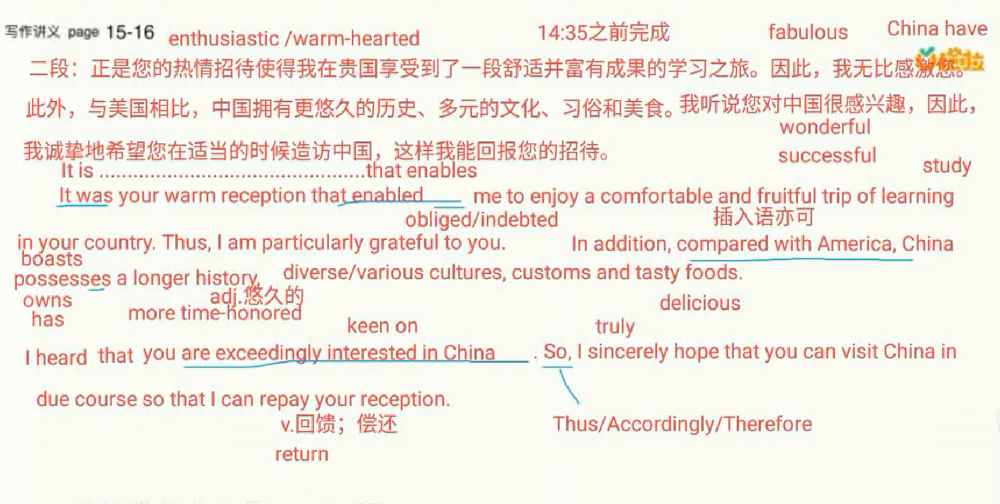

# 6.写作实训-感谢邀请

	#### 1、审题

​			实训6 ： 感谢 + 邀请 （10英二）

​		指令： 你刚刚从美国回来， 作为中美文化交流项目的一员，写一封信给你美国的同事 

​				1、因为你对他的热情招待

​				2、在适当的时候邀请他造访中国

#### 第一段：

​	尊敬的思凯：

​	Dear Sky，

​		非常高兴地回想起过去的这段日子，期间我在美国以中美文化交流项目成员的身份学习。今天我写信想要表达感谢同时邀请您来中国参观。

​		I am quite delighted to recall the past days ，when I studied in American as a member of the Sino-American cultural exchange program。Today，I am writing for the purpose of expressing my thanks and inviting you to visit China。

#### 第二段：

​	正是您热情的招待使得我在贵国享受到了一段舒适并富有成果的学习之旅，因此，我无比感激您。此外，与美国相比，中国拥有更悠久的历史、多元的文化、习俗和美食。我听说您对中国很感兴趣，因此，我诚挚的希望您在适当的时候造访中国，这样我能回报您的招待。

​	It was your warm reception that enabled me to enjoy（享受） a comfortable and fruitful trip of learning in your county. Thus，I am particularly grateful to you。In addition，compared with America，China has a longer history，diverse（各种各样的） cultures，customs and tasty foods。I heard that you are exceedingly interested （很感兴趣）in China. So I sincerely hope that you can visit China in due course so that  I can repay（回馈，回报） your reception。

#### 尾段：

​		我相信，你这次的造访将会带给你更多机会去了解中国，唤起你对中华文明的热情，帮助你享受各种美食。

​		I deem that your visit will bring you more opportunities to know China, arouse your passion for China ‘s  cultures and help you enjoy various delicious foods。

#### 尾段（第二种）

​		我**期待**尽快收到您满意的回复。

​		I am **looking forward to** your favorable reply at earliest convenience。

​																		落款 				Your truly，

​																									Zhang Wei

