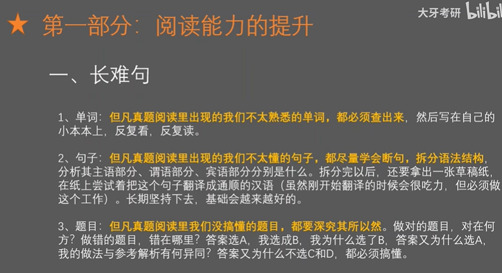

# 学姐分享考研思路1

注意专业考试--计算机专业的是需要考408统考

​		考的内容是：数据结构、操作系统、计算机组成原理、计算机网络

## 1.数学参考

​		同济的

## 2、英语

## 3、政治

​	不太具有参考价值

## 4、专业课

4个课本--是王道的单科书

## 复习经验

​	主要聊一下没门课程的开始时间

​	首先战线不要拉的太长（一俩年这种）一般真正的战争是暑假开始

​	7-8月全身心的准备数学，**高数，和线性代数**，高数作为重点，高数的按张宇的视频学习的高数18讲--视频找的盗版网上的，**线性代数**--用的李永乐老师的**辅导讲义**，数学主要就是做好笔记，做好整理，准备错题本

​	9月份开始复习专业课：先看课本找回忆，重点的是王道的单科书，王道的8套卷，掌握的差不多的时候就可以使用这个试卷检验一下自己

​	英语的准备：没有具体的时间，始终就是贯穿每天都在看--真题很重要，需要好好利用，需要把真题中不会的单词都整理成单词本，这些都是需要反复的去背。

​		基础不好的还是建议先背一些单词，不然做题的时候是很难推进的，就会阅读理解根本看不懂

10月中旬：复习了政治，资料不在多，在精，好好复习的话专门看肖老的书可能就够了，因为在短时间看这么多书是不好吸收的，所以只看肖老的书应该就差不多，后期就是疯狂背肖4，和肖8

#### 学姐分享的考研作息

​	规律的作息是对整个人整体的状态是有帮助的，有研友--有一些共同的问题，一起排解

#### 考研复试注意

​		1.千万不要以为初试成绩还不错就掉以轻心，复试也需要好好准备，做到万无一失

​		2.利用好身边学长学姐的关系，尽早的开始联系导师

​		3.复试的时候尽可能的表现真实的自己，千万不要不懂装懂

​		4.自己要清楚自己的长处在哪里，复试的时候尽量让导师看到你的长处，说服导师为什么要录取你而不是别人

学姐参考分数	

​	8月---12月一共是4个月，每天是7点--23点，每天11个小时左右的学习

​				4个月一共大约需要 120*11 = 1320个小时

​				如果是按4小时算的话----需要330天

​	学姐的总分是   英语二80+政治61+数学二130+计算机综合112 = 383分

#### 学校

​    211的北京学校  --- 华北电力大学，北京工业大学，北京邮电大学

​	普通北京高校：  北京信息科技大学

内蒙古大学的考研 计算机学科条件

