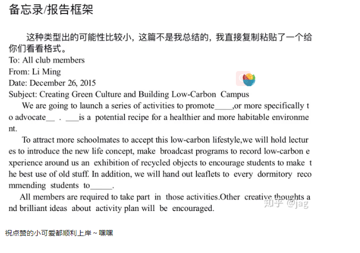

# 考研作文整体框架

#### 	1、小作文

​		小作文大致分俩类，1、公务书信 2、私人书信

​	公务书信就是给不认识的人写信，私人书信就是比较亲密的人写信，比如朋友之类的。如果是公务书信的话，第1句话就自我介绍一下，如果题目给出了你的身份，题目怎么说的，你就怎么介绍自己

#### 	2、细化分类

​		1、寻求帮助

​		2、邀请

​		3、建议

​		4、投诉

​		5、道歉

​		6、感谢

​		7、推荐

​		8、慰问

​		9、申请

​		10、通知--Notice

​		11、祝贺

​		12、回复 --开头不一样

​		13、备忘录/报告 -- 格式不一样

#### 3、大作文

​	https://zhuanlan.zhihu.com/p/272184423

