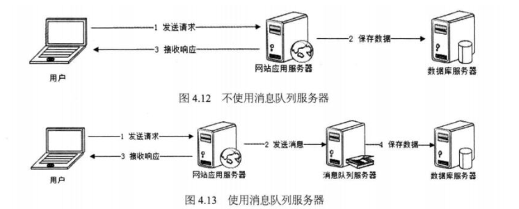
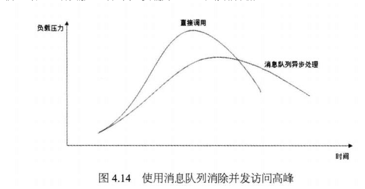
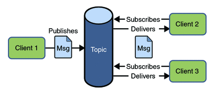

# 消息队列
<!-- MarkdownTOC -->

- [消息队列其实很简单](#消息队列其实很简单)
  - [一 什么是消息队列](#一-什么是消息队列)
  - [二 为什么要用消息队列](#二-为什么要用消息队列)
    - [\(1\) 通过异步处理提高系统性能（削峰、减少响应所需时间）](#1-通过异步处理提高系统性能削峰减少响应所需时间)
    - [\(2\) 降低系统耦合性](#2-降低系统耦合性)
  - [三 使用消息队列带来的一些问题](#三-使用消息队列带来的一些问题)
  - [四 JMS VS AMQP](#四-jms-vs-amqp)
    - [4.1 JMS](#41-jms)
      - [4.1.1 JMS 简介](#411-jms-简介)
      - [4.1.2 JMS两种消息模型](#412-jms两种消息模型)
      - [4.1.3 JMS 五种不同的消息正文格式](#413-jms-五种不同的消息正文格式)
    - [4.2 AMQP](#42-amqp)
    - [4.3 JMS vs AMQP](#43-jms-vs-amqp)
  - [五 常见的消息队列对比](#五-常见的消息队列对比)

<!-- /MarkdownTOC -->

# 消息队列其实很简单

　　“RabbitMQ？”“Kafka？”“RocketMQ？”...在日常学习与开发过程中，我们常常听到消息队列这个关键词。我也在我的多篇文章中提到了这个概念。可能你是熟练使用消息队列的老手，又或者你是不懂消息队列的新手，不论你了不了解消息队列，本文都将带你搞懂消息队列的一些基本理论。如果你是老手，你可能从本文学到你之前不曾注意的一些关于消息队列的重要概念，如果你是新手，相信本文将是你打开消息队列大门的一板砖。

## 一 什么是消息队列

　　我们可以把消息队列比作是一个存放消息的容器，当我们需要使用消息的时候可以取出消息供自己使用。消息队列是分布式系统中重要的组件，使用消息队列主要是为了通过异步处理提高系统性能和削峰、降低系统耦合性。目前使用较多的消息队列有ActiveMQ，RabbitMQ，Kafka，RocketMQ，我们后面会一一对比这些消息队列。

　　另外，我们知道队列 Queue 是一种先进先出的数据结构，所以消费消息时也是按照顺序来消费的。比如生产者发送消息1,2,3...对于消费者就会按照1,2,3...的顺序来消费。但是偶尔也会出现消息被消费的顺序不对的情况，比如某个消息消费失败又或者一个 queue 多个consumer 也会导致消息被消费的顺序不对，我们一定要保证消息被消费的顺序正确。

　　除了上面说的消息消费顺序的问题，使用消息队列，我们还要考虑如何保证消息不被重复消费？如何保证消息的可靠性传输（如何处理消息丢失的问题）？......等等问题。所以说使用消息队列也不是十全十美的，使用它也会让系统可用性降低、复杂度提高，另外需要我们保障一致性等问题。

## 二 为什么要用消息队列

　　我觉得使用消息队列主要有两点好处：1.通过异步处理提高系统性能（削峰、减少响应所需时间）;2.降低系统耦合性。如果在面试的时候你被面试官问到这个问题的话，一般情况是你在你的简历上涉及到消息队列这方面的内容，这个时候推荐你结合你自己的项目来回答。

　　《大型网站技术架构》第四章和第七章均有提到消息队列对应用性能及扩展性的提升。

### (1) 通过异步处理提高系统性能（削峰、减少响应所需时间）

　　如上图，**在不使用消息队列服务器的时候，用户的请求数据直接写入数据库，在高并发的情况下数据库压力剧增，使得响应速度变慢。但是在使用消息队列之后，用户的请求数据发送给消息队列之后立即 返回，再由消息队列的消费者进程从消息队列中获取数据，异步写入数据库。由于消息队列服务器处理速度快于数据库（消息队列也比数据库有更好的伸缩性），因此响应速度得到大幅改善。**

　　通过以上分析我们可以得出**消息队列具有很好的削峰作用的功能**——即**通过异步处理，将短时间高并发产生的事务消息存储在消息队列中，从而削平高峰期的并发事务。** 举例：在电子商务一些秒杀、促销活动中，合理使用消息队列可以有效抵御促销活动刚开始大量订单涌入对系统的冲击。如下图所示：

　　因为**用户请求数据写入消息队列之后就立即返回给用户了，但是请求数据在后续的业务校验、写数据库等操作中可能失败**。因此使用消息队列进行异步处理之后，需要**适当修改业务流程进行配合**，比如**用户在提交订单之后，订单数据写入消息队列，不能立即返回用户订单提交成功，需要在消息队列的订单消费者进程真正处理完该订单之后，甚至出库后，再通过电子邮件或短信通知用户订单成功**，以免交易纠纷。这就类似我们平时手机订火车票和电影票。

### (2) 降低系统耦合性

　　我们知道如果模块之间不存在直接调用，那么新增模块或者修改模块就对其他模块影响较小，这样系统的可扩展性无疑更好一些。

　　我们最常见的**事件驱动架构**类似生产者消费者模式，在大型网站中通常用利用消息队列实现事件驱动结构。如下图所示：

　　**消息队列使利用发布-订阅模式工作，消息发送者（生产者）发布消息，一个或多个消息接受者（消费者）订阅消息。** 从上图可以看到**消息发送者（生产者）和消息接受者（消费者）之间没有直接耦合**，消息发送者将消息发送至分布式消息队列即结束对消息的处理，消息接受者从分布式消息队列获取该消息后进行后续处理，并不需要知道该消息从何而来。**对新增业务，只要对该类消息感兴趣，即可订阅该消息，对原有系统和业务没有任何影响，从而实现网站业务的可扩展性设计**。

　　消息接受者对消息进行过滤、处理、包装后，构造成一个新的消息类型，将消息继续发送出去，等待其他消息接受者订阅该消息。因此基于事件（消息对象）驱动的业务架构可以是一系列流程。

　　**另外为了避免消息队列服务器宕机造成消息丢失，会将成功发送到消息队列的消息存储在消息生产者服务器上，等消息真正被消费者服务器处理后才删除消息。在消息队列服务器宕机后，生产者服务器会选择分布式消息队列服务器集群中的其他服务器发布消息。**   

**备注：** 不要认为消息队列只能利用发布-订阅模式工作，只不过在解耦这个特定业务环境下是使用发布-订阅模式的。**除了发布-订阅模式，还有点对点订阅模式（一个消息只有一个消费者），我们比较常用的是发布-订阅模式。** 另外，这两种消息模型是 JMS 提供的，AMQP 协议还提供了 5 种消息模型。

## 三 使用消息队列带来的一些问题

- **系统可用性降低：** 系统可用性在某种程度上降低，为什么这样说呢？在加入MQ之前，你不用考虑消息丢失或者说MQ挂掉等等的情况，但是，引入MQ之后你就需要去考虑了！
- **系统复杂性提高：** 加入MQ之后，你需要保证消息没有被重复消费、处理消息丢失的情况、保证消息传递的顺序性等等问题！
- **一致性问题：** 我上面讲了消息队列可以实现异步，消息队列带来的异步确实可以提高系统响应速度。但是，万一消息的真正消费者并没有正确消费消息怎么办？这样就会导致数据不一致的情况了!

## 四 JMS VS AMQP

### 4.1 JMS

#### 4.1.1 JMS 简介

　　JMS（JAVA Message Service,java消息服务）是java的消息服务，JMS的客户端之间可以通过JMS服务进行异步的消息传输。**JMS（JAVA Message Service,Java消息服务）API是一个消息服务的标准或者说是规范**，允许应用程序组件基于JavaEE平台创建、发送、接收和读取消息。它使分布式通信耦合度更低，消息服务更加可靠以及异步性。

**ActiveMQ 就是基于 JMS 规范实现的。**

#### 4.1.2 JMS两种消息模型

①点到点（P2P）模型

　　使用**队列（Queue）**作为消息通信载体；满足**生产者与消费者模式**，一条消息只能被一个消费者使用，未被消费的消息在队列中保留直到被消费或超时。比如：我们生产者发送100条消息的话，两个消费者来消费一般情况下两个消费者会按照消息发送的顺序各自消费一半（也就是你一个我一个的消费。）

② 发布/订阅（Pub/Sub）模型

  
　　发布订阅模型（Pub/Sub） 使用**主题（Topic）**作为消息通信载体，类似于**广播模式**；发布者发布一条消息，该消息通过主题传递给所有的订阅者，**在一条消息广播之后才订阅的用户则是收不到该条消息的**。

#### 4.1.3 JMS 五种不同的消息正文格式

　　JMS定义了五种不同的消息正文格式，以及调用的消息类型，允许你发送并接收以一些不同形式的数据，提供现有消息格式的一些级别的兼容性。

- StreamMessage -- Java原始值的数据流
- MapMessage--一套名称-值对
- TextMessage--一个字符串对象
- ObjectMessage--一个序列化的 Java对象
- BytesMessage--一个字节的数据流

### 4.2 AMQP

　　​ AMQP，即Advanced Message Queuing Protocol,一个提供统一消息服务的应用层标准 **高级消息队列协议**（二进制应用层协议），是应用层协议的一个开放标准,为面向消息的中间件设计，兼容 JMS。基于此协议的客户端与消息中间件可传递消息，并不受客户端/中间件同产品，不同的开发语言等条件的限制。

**RabbitMQ 就是基于 AMQP 协议实现的。**

### 4.3 JMS vs AMQP

|对比方向| JMS | AMQP |
| :-------- | --------:| :--: |
| 定义| Java API | 协议 |
| 跨语言 | 否 | 是 |
| 跨平台 | 否 | 是 |
| 支持消息类型 | 提供两种消息模型：①Peer-2-Peer;②Pub/sub| 提供了五种消息模型：①direct exchange；②fanout exchange；③topic change；④headers exchange；⑤system exchange。本质来讲，后四种和JMS的pub/sub模型没有太大差别，仅是在路由机制上做了更详细的划分；|
|支持消息类型| 支持多种消息类型 ，我们在上面提到过| byte[]（二进制）|

**总结：**

- AMQP 为消息定义了线路层（wire-level protocol）的协议，而JMS所定义的是API规范。在 Java 体系中，多个client均可以通过JMS进行交互，不需要应用修改代码，但是其对跨平台的支持较差。而AMQP天然具有跨平台、跨语言特性。
- JMS 支持TextMessage、MapMessage 等复杂的消息类型；而 AMQP 仅支持 byte[] 消息类型（复杂的类型可序列化后发送）。
- 由于Exchange 提供的路由算法，AMQP可以提供多样化的路由方式来传递消息到消息队列，而 JMS 仅支持 队列 和 主题/订阅 方式两种。 

## 五 常见的消息队列对比

对比方向 |概要
-------- | ---
 吞吐量| 万级的 ActiveMQ 和 RabbitMQ 的吞吐量（ActiveMQ 的性能最差）要比 十万级甚至是百万级的 RocketMQ 和 Kafka 低一个数量级。
可用性| 都可以实现高可用。ActiveMQ 和 RabbitMQ 都是基于主从架构实现高可用性。RocketMQ 基于分布式架构。 kafka 也是分布式的，一个数据多个副本，少数机器宕机，不会丢失数据，不会导致不可用
时效性| RabbitMQ 基于erlang开发，所以并发能力很强，性能极其好，延时很低，达到微秒级。其他三个都是 ms 级。
功能支持| 除了 Kafka，其他三个功能都较为完备。 Kafka 功能较为简单，主要支持简单的MQ功能，在大数据领域的实时计算以及日志采集被大规模使用，是事实上的标准
消息丢失| ActiveMQ 和 RabbitMQ 丢失的可能性非常低， RocketMQ 和 Kafka 理论上不会丢失。

**总结：**

- ActiveMQ 的社区算是比较成熟，但是较目前来说，ActiveMQ 的性能比较差，而且版本迭代很慢，不推荐使用。
- RabbitMQ 在吞吐量方面虽然稍逊于 Kafka 和 RocketMQ ，但是由于它基于 erlang 开发，所以并发能力很强，性能极其好，延时很低，达到微秒级。但是也因为 RabbitMQ 基于 erlang 开发，所以国内很少有公司有实力做erlang源码级别的研究和定制。如果业务场景对并发量要求不是太高（十万级、百万级），那这四种消息队列中，RabbitMQ 一定是你的首选。如果是大数据领域的实时计算、日志采集等场景，用 Kafka 是业内标准的，绝对没问题，社区活跃度很高，绝对不会黄，何况几乎是全世界这个领域的事实性规范。
- RocketMQ 阿里出品，Java 系开源项目，源代码我们可以直接阅读，然后可以定制自己公司的MQ，并且 RocketMQ 有阿里巴巴的实际业务场景的实战考验。RocketMQ 社区活跃度相对较为一般，不过也还可以，文档相对来说简单一些，然后接口这块不是按照标准 JMS 规范走的有些系统要迁移需要修改大量代码。还有就是阿里出台的技术，你得做好这个技术万一被抛弃，社区黄掉的风险，那如果你们公司有技术实力我觉得用RocketMQ 挺好的
- kafka 的特点其实很明显，就是仅仅提供较少的核心功能，但是提供超高的吞吐量，ms 级的延迟，极高的可用性以及可靠性，而且分布式可以任意扩展。同时 kafka 最好是支撑较少的 topic 数量即可，保证其超高吞吐量。kafka 唯一的一点劣势是有可能消息重复消费，那么对数据准确性会造成极其轻微的影响，在大数据领域中以及日志采集中，这点轻微影响可以忽略这个特性天然适合大数据实时计算以及日志收集。

参考：《Java工程师面试突击第1季-中华石杉老师》
