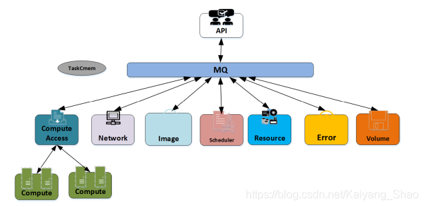
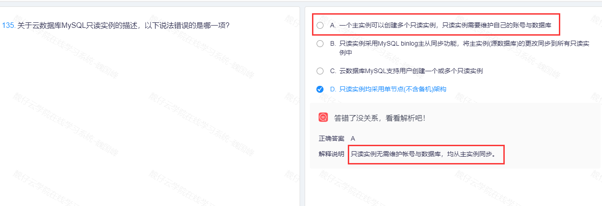

# 1.名词解释

​	1.SLB: 负载均衡

​	2.应用迁移 ADAM：Advanced Database&Application Migration（以下简称ADAM） 是一款把数据库和应用迁移到阿里云（公共云或专有云）的产品，显著地降低了上云的技术难度和成本，尤其是Oracle数据库应用。ADAM全面评估上云可行性、成本和云存储选型，内置实施协助，数据、应用迁移等工具，确保可靠、快速上云。

​	3.CDN：CDN的全称是Content Delivery Network，即内容分发网络。其目的是通过在现有的internet中增加一层新的网络[架构](https://so.csdn.net/so/search?q=架构&spm=1001.2101.3001.7020)，将网站的内容发布到最接近用户的网络边缘，使用户可以就近取得所需的内容，提高用户访问网站的响应速度。CDN有别于镜像，因为它比镜像更智能，或者可以做这样一个比喻：CDN=更智能的镜像+缓存+流量导流。因而，CDN可以明显提高Internet网络中信息流动的效率。从技术上全面解决由于网络带宽小、用户访问量大、网点分布不均等问题，提高用户访问网站的响应速度。

​	4.TDSQL：*TDSQL*是腾讯推出的一款兼容MySQL的自主可控、高一致性分布式数据库产品。这里我们强调一点，高度兼容MySQL——*TDSQL*完全兼容MySQL协议，并且做到完全自主可控

	5.VStation：各个模块之间通过消息队列的方式进行间接通信，每个模块监听特定的队列并提供一个回调函数，框架会将参数传递给回调函数执行。

6.CVM：  Cloud Virtual Machine 云虚拟服务器

7.TCE监控告警：

8.TSF:Tencent Service Framework，TSF 腾讯服务框架

9.SCF:Serverless Cloud Function，SCF--腾讯云为企业和开发者们提供的无服务器执行环境，帮助您在无需购买和管理服务器的情况下运行代码。您只需使用平台支持的语言编写核心代码并设置代码运行的条件，即可在腾讯云基础设施上弹性、安全地运行代码。云函数是实时文件处理和数据处理等场景下理想的计算平台。

10.腾讯云弹性伸缩AS：可以根据用户的业务需求和策略，自动调整计算资源。弹性伸缩根据用户设置的定时策略、周期策略或监控策略，恰到好处地增加或减少 CVM 实例并完成配置，如在业务需求高峰增长时自动增加 CVM 实例，保证业务平稳健康运行。在业务需求下降时自动减少 CVM 实例，节约资源和成本。

11.DTS：数据传输服务

12.COS：对象存储--腾讯云COS与隔壁阿里云的OSS都是提供对象存储的服务，（即文件存储）。比如图片，压缩包，安装包，视频，网站css文件.......（好像绝大多数格式的文件都能上传）。

13.CBS：云硬盘--选B，挂载和卸载无需重启

14.Sidecar模式：将应用程序的组件部署到单独的进程或容器中,以提供隔离和封装。此模式还允许应用程序由异构组件和技术实现

15.云数据库MySQL--RO

16.MySQL只读实例

17.CAM：访问管理

18.云原生应用的12要素：

19.ECS：云服务器(Elastic Compute Service,简称 *ECS*)是一种简单高效、处理能力可弹性伸缩的计算服务,帮助您快速构建更稳定、安全的应用

