# 2.题库1-100

# **腾讯云考试题库**

 

 

1. 在腾讯云上同时提供很多的网络产品与功能，其中包括私有网络和子网，下列关于私有网络和子网的关系描述中，正确的有哪项？

 

 

 

2.腾讯云的计算服务提供多种多样的云服务器镜像，那么下列关于镜像的描述正确的有哪项?(1.0分)

 

 

 

 

3.前期您在腾讯云上的基础网络内部署了5台CVM，后期为了更好的安全性和隔离性，您所有的业务都部署在VPC中，针对您早期部署在基础网络中的5台CVM，应该通过以下哪项功能与VPC中的业务进行内网通信？(1.0分)

 

4.一个做新闻的互联网公司有一个由Java开发的本地应用，允许外部搜索其后端目录并检索新闻页。他们将旧报纸扫描程JPEG图片(大约17TB)，同时使用了OCR产品。现在他们把平台迁移到腾讯云上来,希望有一个可以节约成本的架构，且要兼具可用性与持款性。下面哪个方面是最合适的?(1.0分)

 

 

5. 关于EDAS(DRDS)提供的小表广播特性,以下描述错误的是( )。(1.0分)

 

 

6. 共享单车的公司根据会员所在地将其上百万的客户划分了36个库,为了更细致的展示不同性别客户使用单车的习惯，公司需要每周跑出男女使用单车时长等信息的展示，但是每次使用,都会产生大量的操作，请问该怎样才能够解决这个问题？(1.0分)

 

 

7.如果某SLB后端的实例出现健康监测失败, 将会发生什么?(1.0分)

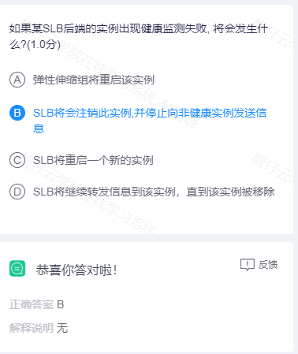

8.专有云是云计算服务提供商为政府/企业建设的本地化部署的云计算系统。为确保业务服务的高可用,不可以采用以下____方案作为发有云可用容灾方案?(1.0分)

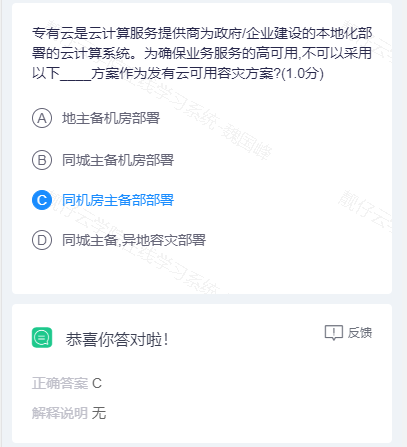

9.随着互联网的兴起，互联网的技术架构相比传统的IT架构来说在可扩展性和性价比方面的优势越来越明显，许多传统企业希望把他们的IT系统朝着互联网架构进行改造，用户可以使用_____将数据库从Oracie体系迁移到MySQL分布式体系?(1.0分)

​	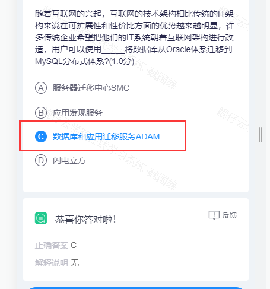

10.小董开发了邮政编码识别程序，能够根据国内邮政编码快速查询到对应的省市，为了能够快速完成开发,他直接购买了查询邮编信息的API,作为一个独立开发者,资金毕竟有限，他一方面希望服务更多的用户,另一方面不希望API被无效使用或者浪费，请问他该采用什么来实现要求呢?(1.0分)

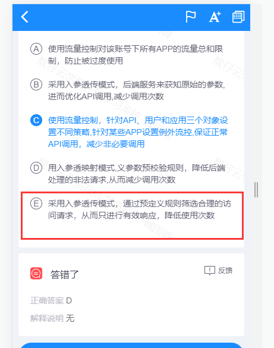

11.某云上用户经常受到10G以上DDos冲击，为了获得更好的业务连续性，用户同时开通了Web应用防火墙服务、CDN、高防IP等三种安全产品，如果你是腾讯云的架构师，为了确保三种服务组合能够达到最佳防护效果，建议用户部署的架构是?(1.0分)

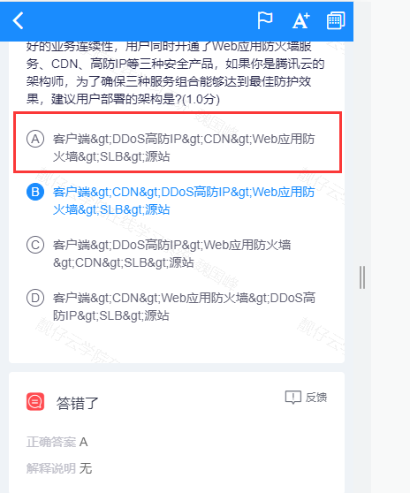

 12.关于TDSQL的描述，以下哪一项的说法是错误的?(1.0分)

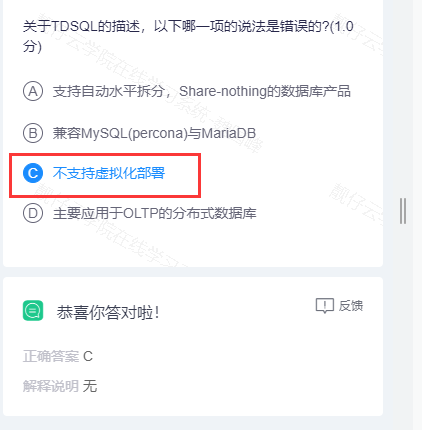

13.以下关于TDSQL配置管理的描述，哪一项是错误的?(1.0分)

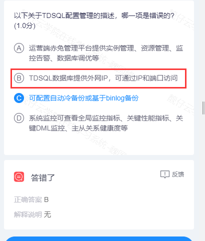

14.在云计算整个架构中，包含非常多的关键技术，以下关于云计算中关键技术的描述中，错误的有哪项？(1.0分)

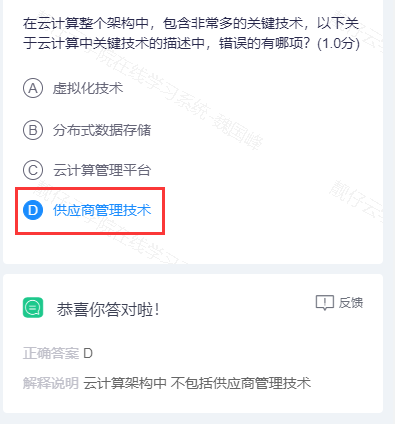

15.腾讯云在私有网络中同时提供了多种产品，以下哪个网络产品是免费的？(1.0分)

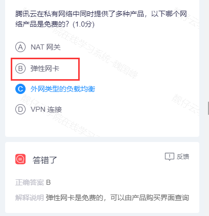

16.关于弹性伸缩AS配置的描述，以下哪一项是错误的?(1.0分)

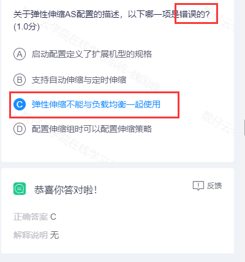

17.关于VStation的描述，以下哪项是错误的?(1.0分)

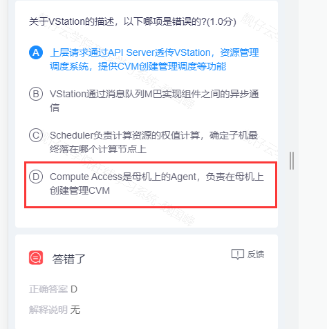

18.您正在腾讯云上规划私有网络以及子网，您需要确定网络掩码，目前您已经确定此业务最大不会超过80台机器，那么此时您应该在子网上使用下列哪项网络掩码来达到最优状态？(1.0分)

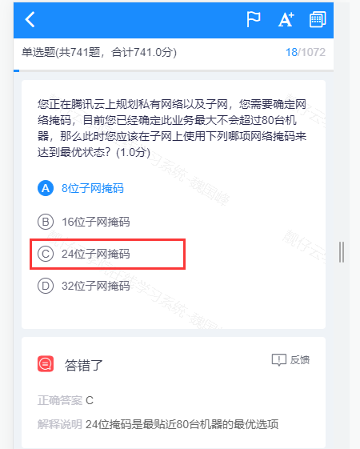

19.以下关于Redis架构原理的描述，哪一项是错误的?(1.0分)

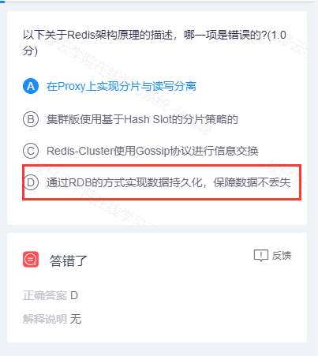

 20.腾讯云中有很多CDN的边缘节点对外提供服务，下列关于CDN的边缘节点描述中，正确的有哪项？(1.0分)

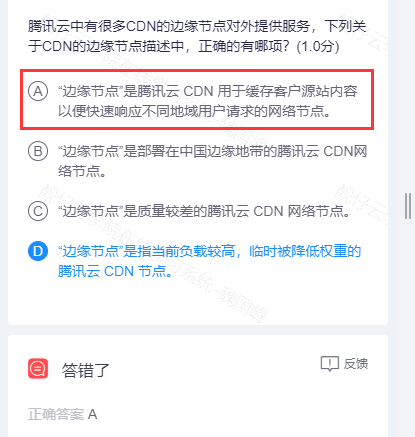

21.关于产品配额管理的描述，哪一项是正确的?(1.0分)

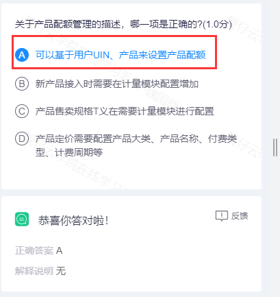

22.腾讯云上提供多个地域和可用区，其中处于同一私有网络下的上海一区和上海三区的云资源，是通过以下哪种方式进行通信的？(1.0分)

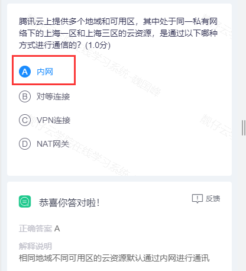

 

 

 23.关于TCE监控告警的描述。以下哪项是错误的?(1.0分)

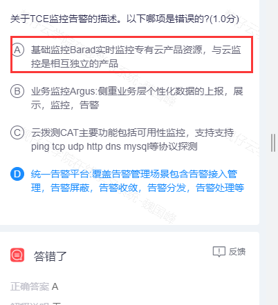

 

 

 24.

 

 

 

 

 

 

 

 

 

 

 

 

 

 

 

 

 

 

 

 

 

 

 

 

 

 

 

 

 

 

 

 

 

 

 

 

 

 

 

 

 

 

 

 

 

 

 

 

 

 

 

 

 

 

 

 

 

 

 

 

 

 

 

 

 

 

 